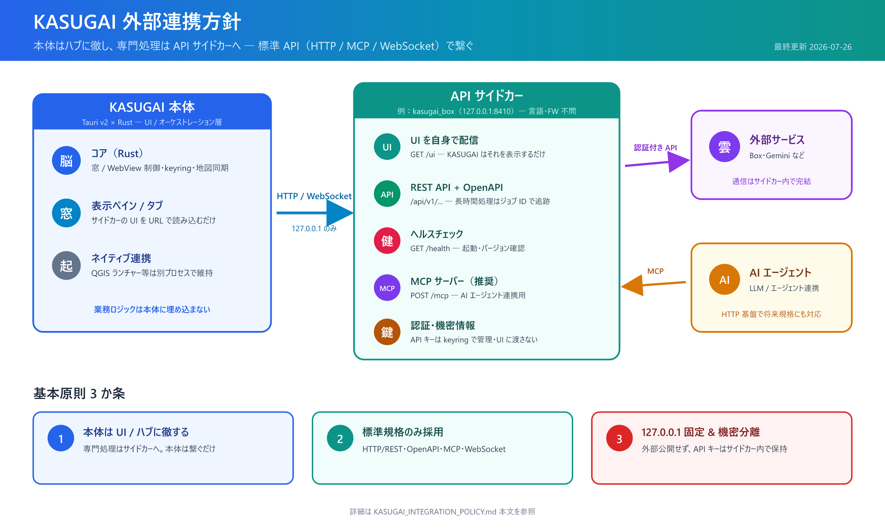
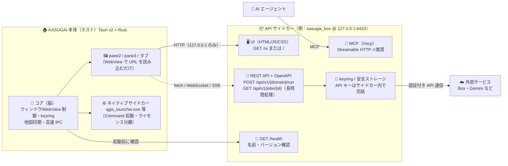

# KASUGAI 外部連携方針・API サイドカー実装指示書

最終更新：2026-07-26

## 全体像（インフォグラフィックス）



<details>
<summary>テキスト版（Mermaid 図）</summary>



</details>

### 基本原則 3 か条

| 原則 | 内容 |
| :--- | :--- |
| 🎯 **本体は UI/ハブに徹する** | 業務ロジックを KASUGAI 本体（Rust）に埋め込まない |
| 🌐 **標準規格のみ採用** | HTTP/REST + OpenAPI・MCP・WebSocket。独自プロトコル禁止 |
| 🔒 **127.0.0.1 固定 & 機密分離** | `0.0.0.0` バインド禁止。API キーはサイドカー内 keyring で管理 |

## 対象範囲

本ドキュメントは、KASUGAI と外部の専用ツール・サービスを接続する **新規連携** 全般に適用します。  
本ドキュメントを読む対象者は次の 2 つです。

- **ホスト側**：KASUGAI 本体を開発・運用する担当者
- **クライアント側**：`kasugai_box` など、KASUGAI に接続する **API サイドカー** を新規作成する担当者

既存の Tauri/Rust ネイティブ機能（ウィンドウ/WebView 制御、keyring、地図同期、QGIS ランチャー呼び出し等）は、既存の `kasugai.md` システム構成に従い維持します。

## Sidecar に関する用語整理

KASUGAI プロジェクト内では「Sidecar/サイドカー」が複数の意味で使われています。本ドキュメントで推奨するのは **API サイドカー** です。

- **ネイティブサイドカー**  
  QGIS ランチャー（`qgis_launcher.exe`）のように、KASUGAI から `Command` で起動する独立したネイティブアプリケーション。ライセンス分離や既存ツール連携に使用する。実装：`kasugai/src-tauri/src/main.rs`。

- **オフラインインストーラー内包方式**  
  WebView2 ランタイム等をインストーラーに同梱してオフライン環境に展開する仕組み。実装：`kasugai/src-tauri/windows/installer.nsi`。

- **API サイドカー（本ドキュメントで推奨）**  
  新規の外部専用機能を HTTP/REST/MCP/WebSocket などの標準 API で通信するローカルサービスとして提供する。`kasugai_box` 等が該当する。KASUGAI は WebView または HTTP クライアントとして利用する。

## 基本原則

KASUGAI は「鎹」として、外部の専用ツールを **API（HTTP/Web 標準）で繋ぐハブ** です。  
本体は UI/オーケストレーション層に徹し、専門処理は外部の **API サイドカー** に任せ、軽量かつ拡張性の高い構成を維持します。

KASUGAI コア（Tauri/Rust）は「脳」として窓/WebView制御・OS資格情報・高速IPC・既存ネイティブ機能を担い、外部サービスとの業務ロジックは可能な限り **API サイドカー**（HTTP/MCP/WebSocket）で実装します。

## 1. API サイドカー実装者向け指示

### 1.1 提供するべきもの

API サイドカーは、以下を少なくとも提供してください。

| 項目 | 必須 | 内容 |
| :--- | :--- | :--- |
| **HTTP サーバー** | ✅ 必須 | `127.0.0.1` にバインドする軽量 Web サーバー（言語・FW 不問） |
| **REST API** | ✅ 必須 | 主要処理を呼び出す JSON 形式のエンドポイント群 |
| **OpenAPI 仕様** | ✅ 必須 | `openapi.yaml`（または `openapi.json`）を `/openapi.yaml` またはリポジトリルートに配置 |
| **UI エントリ** | ✅ 必須 | KASUGAI ペインで読み込む HTML/JS/CSS（例：`/ui` または `/`） |
| **ヘルスチェック** | ✅ 必須 | `GET /health` などで起動確認ができるエンドポイント |
| **MCP サーバー** | 推奨 | AI エージェント連携を見据えて `/mcp` または Streamable HTTP で提供 |
| **WebSocket** | 任意 | リアルタイム双方向が必要な場合に提供 |

### 1.2 ポート管理

- 待ち受けアドレスは **`127.0.0.1`（IPv4 ループバック）固定** とし、`0.0.0.0` にはバインドしない。
- ポートはサイドカーごとに **既定ポートを 1 つ定めて文書化** する（例：`kasugai_box` は `127.0.0.1:8410`）。
- 既定ポートが使用中の場合に備え、**設定ファイルまたは環境変数（例：`KASUGAI_BOX_PORT`）で変更可能** にする。
- KASUGAI 側は設定画面/設定ファイルでサイドカーの URL（`http://127.0.0.1:<port>`）を管理する。
- 既定ポートは KASUGAI プロジェクト内で重複しないよう、本ドキュメント末尾の「サイドカー登録簿」に記載する。

### 1.3 通信プロトコル

- **HTTP/REST + JSON** を基本とする
- ステータスコードは HTTP 標準に従う（2xx 成功、4xx クライアントエラー、5xx サーバーエラー）
- エラー応答は統一フォーマットを推奨
  ```json
  { "error": "短いメッセージ", "detail": "詳細（任意）" }
  ```
- **長時間処理**は同期応答にせず、`202 Accepted` + ジョブ ID を返し、`GET /api/v1/jobs/{id}` で進捗・結果を取得できるようにする
  ```json
  { "jobId": "abc123", "status": "running", "progress": 42 }
  ```
- リアルタイム通信が必要な場合は **WebSocket** または **Server-Sent Events（SSE）** を使用する

### 1.4 推奨エンドポイント構成

| 用途 | メソッド・パス | 例 |
| :--- | :--- | :--- |
| ヘルスチェック | `GET /health` | `{ "status": "ok", "name": "kasugai_box", "version": "0.2.0" }` |
| 設定取得 | `GET /api/v1/config` | サイドカー設定、KASUGAI 表示用 URL 等 |
| 設定更新 | `POST /api/v1/config` | 認証情報はサイドカー内で保持 |
| 主処理実行 | `POST /api/v1/{domain}/run` | `kasugai_box` なら `/api/v1/photos/process` 等 |
| ジョブ状態取得 | `GET /api/v1/jobs/{id}` | 長時間処理用 |
| UI | `GET /ui` または `/` | KASUGAI の WebView で読み込む |
| OpenAPI | `GET /openapi.yaml` | 自動生成推奨 |
| MCP | `POST /mcp` | Streamable HTTP または JSON-RPC 2.0 |

### 1.5 UI の提供方法

- UI はサイドカー自身が配信する。KASUGAI はただその URL を WebView で読み込むだけ。
- UI 内では `window.__TAURI__.core.invoke` ではなく、**標準 Web API（`fetch` / `WebSocket`）** を使用する。
- UI をサイドカー自身のオリジン（`http://127.0.0.1:<port>`）から配信し、同一オリジンで API を呼ぶ構成にすれば **CORS 設定は不要**（推奨）。
- KASUGAI 本体の UI（Tauri WebView）から直接 API を呼ぶ場合は、CORS でそのオリジンを許可する。
  - Tauri v2 の WebView（Windows）のオリジンは `http://tauri.localhost`
  - 開発時のブラウザ確認用に `http://localhost:<port>` 等も必要に応じて許可
- 認証・処理・機密情報の保持は API サイドカー側で完結する。

### 1.6 認証・機密情報の扱い

- Box や Gemini などの API キー・トークンは、サイドカー内の **keyring または OS の安全ストレージ** で管理する。
- UI には平文の API キーを渡さない。
- サイドカーは `127.0.0.1` 専用で、外部ネットワークからはアクセス不可にする。
- `127.0.0.1` 限定でも **同一 PC 上の他プロセスやブラウザからはアクセス可能** である点に注意する。破壊的操作や機密情報を扱うエンドポイントには、起動時に生成するローカルトークン（`Authorization: Bearer <token>` 等）による簡易認可を推奨する。

### 1.7 MCP 対応

- AI エージェントからの呼び出しを見越し、必要に応じて **MCP サーバー** を実装する。
- MCP はまだ進化中のため、**HTTP/REST との併用**が必須。
- トランスポートは **Streamable HTTP** を優先し、STDIO によるプロセス増大を避ける。
- MCP エンドポイントは `/mcp` 等にまとめ、OpenAPI 側と同じポートで提供しても構わない。

### 1.8 単体動作・配布

- 各 API サイドカーはブラウザや `curl` から単体で動作確認できること。
- 配布は単体実行ファイル、NSIS/MSI インストーラー、または zip 等、独立した形態を維持する。
- KASUGAI 側にはエンドポイント URL、プロトコル、バージョンの設定だけを持つ。

### 1.9 バージョニング

- API パスにバージョンを含めることを推奨：`/api/v1/...`
- 破壊的変更を行う場合は `/api/v2/...` へ移行し、旧バージョンは一定期間維持する。
- `GET /health` でサイドカー名とバージョンを返し、KASUGAI 側で互換性を確認できるようにする。

## 2. KASUGAI 側（ホスト）の連携ルール

- KASUGAI 内部に新しい業務用 Rust バックエンドを埋め込まない。
- API サイドカーは、URL を KASUGAI の `pane2` / `pane3` / 新規タブで開く。
- サイドカーの起動は、可能であれば KASUGAI から `Command` または設定ファイルで行う。独立起動でも構わない。
- サイドカーが提供する `GET /health` で起動を確認してから UI を読み込むことを推奨。
- ネイティブ実行が必要な既存機能（QGIS ランチャー等）は別プロセスのまま維持し、ライセンス・権限分離を保つ。

## 3. 標準規格の採用

- UI/人間向け：**HTTP/REST + OpenAPI**
- AI/LLM 向け：**MCP（Model Context Protocol）**
- リアルタイム双方向通信：**WebSocket**（Re:Earth プラグイン等で実績あり）
- 独自のプロトコルやバイナリ規格を新規に作るのは避ける。

## 4. セキュリティ・権限分離

- API サイドカーは `127.0.0.1` 専用で外部からはアクセス不可にする。
- API キー・認証情報は API サイドカー内の keyring/安全ストレージで管理し、UI には漏らさない。
- ライセンスや権限が異なる処理は別プロセス（サイドカー）で分離し、KASUGAI 本体を汚さない。

## 5. 将来性と互換性

- 新たな AI プロトコル（A2A 等）が登場しても、HTTP 基盤があれば対応可能。
- クラウド版や他デスクトップ環境への移行も、同じ API 契約を維持することで容易にする。

## 既存システムとの関係

- 現在の KASUGAI は Tauri v2 × Rust でウィンドウ/WebView 制御、地図同期、外部サイトのナビゲーションインターセプト等を Rust コアで実装しています。本ドキュメントはそれらを否定せず、**新規の外部ドメイン連携**を API ファーストに移行することを定めます。
- `re_erath_connect.md` で検証済みの WebSocket 連携も、本ドキュメントにおける標準的なリアルタイム通信手段として位置づけられます。

## 実装手順例（kasugai_box 等）

1. 既存の `kasugai_box` を **HTTP サーバー化**（Rust/Axum 等、言語不問）
2. `process_photos` 等を `POST /api/v1/photos/process` 等の REST API に置き換え
3. 認証・Box API 通信・EXIF 処理をサイドカー内に閉じる
4. UI 用 HTML/JS/CSS を `/ui` または `/` で配信
5. `openapi.yaml` と MCP エンドポイントを配置
6. KASUGAI 側に URL とポートの設定を追加し、ペイン/タブで開く

## サイドカー登録簿

| サイドカー名 | 既定ポート | 状態 | 備考 |
| :--- | :--- | :--- | :--- |
| `kasugai_box` | `8410`（予定） | HTTP サーバー化 予定 | Box 写真 EXIF 抽出・GeoJSON/CSV 出力・Box API チャット |

新しいサイドカーを追加する場合は、この表に名前・既定ポート・状態を追記してください。

## 参考

- [KASUGAI システム構成 & 設定仕様書](./kasugai.md)
- [Re:Earth 外部通信まとめ](./re_erath_connect.md)
- [kasugai_box README](../kasugai_box/README.md)
