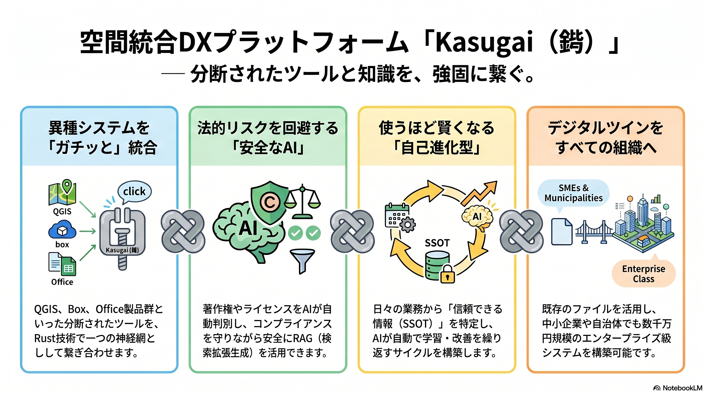

# Kasugai：自己進化型・空間統合DXプラットフォーム

**プロジェクト名「Kasugai（鎹）」の由来**
> 「鎹（かすがい）」とは、日本の伝統建築において、2つの離れた木材をガッチリと繋ぎ止めるための「コの字型の鉄釘」を指します。
> 本プロジェクトは、QGIS、Box、Office製品群、そしてAIといった、本来であれば分断されている強力な異種システム同士を、Tauri × Rustという強靭な技術で「ガチッと繋ぎ止める接合部（ハブ）」となることを目指し、この名が付けられました。

本プロジェクトは、分断されたローカル環境とクラウドサービスを一つの神経網として統合し、現実世界と連携する次世代のDX（デジタル・トランスフォーメーション）基盤を構築するオープンソース・イニシアティブです。

[最新版ダウンロード](https://yamamoto-ryuzo.github.io/kasugai/download/kasugai.zip)

## 1. 背景と課題 (Background & Problem Statement)

現代の多くの組織において、システムとデータの分断は深刻なレベルに達しています。
特定の商用ベンダーへの過度な依存は**「オープンソース等の多様なツールの連携」**を阻んでいます。さらに、AI時代に不可欠な「RAG（検索拡張生成）のソース管理」においても、著作権やコンプライアンスリスクに対する恐れからクローズドなデータ運用を余儀なくされており、**「社会全体で共有・再利用可能なオープンデータの形成」**が大きな壁にぶつかっています。これらの「閉じたシステム」と「閉じたデータ」が引き起こす非効率は、以下の具体的な課題として顕在化しています。

[KASUGAI_概要動画はこちら](https://youtu.be/wEtE6rjQa9I)


[KASUGAI+_概要動画はこちら](https://youtu.be/oyQLvoJZXEA)

### 1.1. データと現実空間の乖離
文書データ（例：現場報告書、各種申請書）と、それが指し示す地理的・空間的コンテキストとの間にシステム的な繋がりが欠落しています。これにより、利用者はドキュメント管理システムとGIS（地理情報システム）の間を手動で往復する非効率を強いられています。

### 1.2. 信頼できる唯一の情報源（SSOT）の喪失
ローカルPCやネットワークドライブ（Samba/SMB等）には重複ファイルや旧版が溢れ、最新かつ正確な情報の特定が困難です。従来のベクトル検索に基づくRAG（検索拡張生成）はノイズを排除できず、AIのハルシネーション（幻覚）や出力の信頼性低下を招いています。

### 1.3. ベンダーロックインによる連携阻害
特定ベンダーの製品エコシステムは、外部のクラウド（Box等）やオープンソースの専門ツール（QGIS等）とのシームレスな統合を制限し、組織全体のシステム最適化を妨げています。

### 1.4. AI活用におけるコンプライアンスとライセンスの壁
エンタープライズ環境でのAI運用には、2つの異なる次元での法的リスクが存在します。
第一に**「プログラム（システム）上のライセンス問題」**です。GPL等の厳格なオープンソースライセンスを持つツールをシステムに直接組み込むことで、自社システム全体がライセンス汚染（ソースコード公開義務の波及等）を受けるリスクがあります。
第二に**「データとしての著作権・ライセンス問題」**です。業務環境には、自社の機密データだけでなく、パブリックドメイン（著作権フリー）の資料や、クリエイティブ・コモンズ（CCライセンス）が付与された外部データ（※「非営利目的のみ可」「改変禁止」等の条件付き）が複雑に混在しています。これらを無差別にRAGの知識ソースとして取り込むと、AIの出力が意図せぬ権利侵害や利用許諾違反を引き起こす重大なコンプライアンス違反に直結します。

### 1.5. 社会全体で共有可能な「安全な知識基盤（オープンデータ）」の欠如
上記1.4のリスクに対する恐れから、多くの企業や自治体はデータ共有に対して極度に保守的になり、「自組織の壁の中」だけでAIを運用せざるを得なくなっています。結果として、社会全体で再利用可能な「安全で権利クリアなRAGソース（オープンデータ）」が蓄積されず、日本全体でのDXやAI活用の足かせとなっています。

## 2. システムアーキテクチャ設計 (System Architecture Design)

上記の課題を解決するため、本プラットフォームは「Web技術の柔軟性」と「ネイティブ環境の実行権限」を両立するハイブリッド・アーキテクチャを採用しています。

### 2.1. 中核技術：Tauri × Rust の選定理由
本プロジェクトが目指す「Web（クラウド）とローカル（デスクトップ）のシームレスな連携」を実現するため、`Tauri × Rust`を中核技術として選定しました。
1. **デスクトップとWebの融合**: UI層にはWeb技術を活用し、既存の資産（Re:Earth等のWebGIS）を統合。一方、重負荷なデータ処理やローカルファイル、専門ソフト（QGIS等）との連携は、ネイティブコード（Rust）で高速かつ安全に処理します。
2. **プログラムのライセンス分離とセキュリティ**: Tauri/Rustの寛容なライセンス（MIT/Apache 2.0）を活かし、GPL等の厳格なライセンスを持つ外部ツール（QGISのコンポーネント等）は「Sidecar（別プロセス）」として物理的に分離して実行します。これにより、システム本体へのライセンス汚染を構造的に防ぎます。また、OSレベルの権限操作もRust側で厳格に制御されるため、高いセキュリティが保たれます。
3. **リソース効率と配布の最適化**: 実行ファイルのサイズを極限まで削減（10〜15MB程度）。軽量かつ高速な起動を実現し、環境に依存しない安定した運用を可能にします。

### 2.2. マルチ・ウィンドウによる統合UIレイヤー（地図・空間データ特化型ブラウザー）
本プラットフォームは、実質的に**「地図・空間データ特化型の専用ブラウザー」**として機能します。Tauriのマルチウィンドウ管理を活用し、タスクごとに最適化されたワークスペースを並列提供します。
- **空間可視化（デジタルツイン・GIS）**: `Re:Earth`や`Google Maps`、`Yahoo Map`、`Mapion`など複数の地図サービスを同一画面内にシームレスに統合し、地理空間コンテキスト上で全業務データを可視化します。
- **CDE（共通データ環境）管理**: `Box`等のクラウドストレージやLAN上のSamba共有ファイルをネイティブアプリの速度で直接操作。地図上のオブジェクトとのリアルタイム連動を実現します。
- **対話型コンソール（次世代AI統合）**: 自然言語によるプラットフォーム横断タスク（例：「現在進行中のプロジェクト最新報告書を3Dマップ上に展開」等）をオーケストレーションする専用のAIインターフェースです。この地図特化型ブラウザーにAIが搭載されることで、空間情報の文脈を理解する自律型プラットフォームが完成します。

## 3. コア機能：自己進化型AIパイプライン (Self-Evolving AI Pipeline)

システムのインテリジェンスは、単なる情報検索ではなく、利用者の行動を学習し自己改善を続ける「2段階のデータフライホイール」によって実現されます。

### 3.1. フェーズ1：知識の構造化（GraphRAGによるSSOTの特定）
データ間の意味的つながりを解析し、検索拡張生成（RAG）の精度と法的な安全性を担保します。
1. **データとしての機密性・著作権スクリーニングと分類**: Rustバックエンドがファイル操作を監視する際、対象データの機密レベルに加え、データコンテンツとしての著作権・ライセンス情報を自動判定します。特に、**対象がパブリックドメイン（CC0等）であるか、クリエイティブ・コモンズ（CCライセンス）のどの条件（BY:表示、NC:非営利、ND:改変禁止 等）に該当するかを識別・ラベリング**します。自社の利用ポリシーに反する条件を持つデータはRAGソース化の段階で確実に遮断するだけでなく、「どのデータがオープンソースとして安全に再利用・共有可能か」をシステム内で自動整理します。
2. **知識グラフの構築**: 複数ユーザーの行動パターンを解析し、単語間の関連性や文書の重要度を学習。安全性が担保されたデータ同士を意味で結びつけたネットワークを構築します。
3. **SSOTの特定とオントロジー生成**: 知識グラフの構造から、組織内の「真の正解（SSOT）」を特定。固有の業務文脈（オントロジー）を動的に形成します。
4. **デジタルツインへの統合**: 特定されたSSOTをQGIS等の地理空間データと紐付け、デジタルツイン上の正確な座標へ自動マッピング。AIが常に「適法かつ正確」な情報源を参照する基盤となります。

### 3.2. フェーズ2：知識の深化（継続的学習による自己改善）
リアルタイム検索の精度を高めるフェーズ1に対し、フェーズ2はAIモデル自体の推論能力を恒久的に向上させます。
1. **推論ログの教師データ化**: GraphRAGがSSOTの特定に成功したプロセス（専門家の思考プロセスに相当）を、高品質な学習データ（JSONL等）へ自動整形。
2. **セキュアなファインチューニング（LoRA）**: 業務時間外のローカルGPUリソースを活用し、軽量アダプター（LoRA）としてモデルを追加学習。外部への情報流出を完全に遮断します。
3. **無停止でのモデル更新**: 古い知識の忘却プロセス（知識の新陳代謝）を組み込み、生成されたLoRAを動的適用（ホットスワップ）。システムを停止することなくAIを最新の組織知識に適応させます。

## 4. セキュア環境・LGWANへの展開 (Deployment in Secure Environments)

高度なセキュリティ要件を持つ閉鎖網（LGWAN等）での運用を前提としたアーキテクチャを備えています。
- **Sidecar方式によるオフライン導入**: Windows標準の描画エンジン（WebView2）のインストーラーをバイナリに内包。初回起動時にバックエンド（Rust）が環境を評価し、必要に応じてサイレントインストールを実行。ネットワーク接続に依存しない完全なオフライン環境での確実なデプロイを実現します。

## 5. プロジェクトの意義と社会への貢献 (Vision & Social Impact)

本プロジェクトは、特定の商用ベンダーに依存しない**「異種ツール間のオープンな相互運用性」**と、AI導入の最大の壁である**「データクレンジングと継続的学習の完全自動化」**をOSSとして提供します。この技術的ブレイクスルーは、単一組織の業務改善を超え、社会全体の事務効率化（DX）を牽引する以下の公共的価値を創出します。

### 5.1. 「安全なオープンデータ基盤」の自律的形成
本プラットフォームが提供する「著作権・ライセンスの自動スクリーニング・分類機能」は、社内やネットワーク上に眠る膨大なデータから、**「AIの学習やRAGソースとして、誰もが安全に利用・再利用できるオープンデータ」を自動抽出・整理**します。
各組織が本プラットフォームを利用して業務を行うだけで、ライセンスがクリア化された「良質なナレッジベース（SSOT）」が自律的に形成・蓄積されていきます。これにより、著作権リスクを恐れることなく、安全で信頼性の高いRAGソースを企業間や自治体間で相互に共有できる土壌が生まれ、社会全体のAI活用リテラシーが飛躍的に向上します。

### 5.2. すべての組織に「自己進化型AI・デジタルツイン」を
予算やITリソースに制約のある中小企業や地方自治体であっても、本プラットフォームを「接着剤」として導入するだけで、既存の資産（Samba上の共有ファイル、Excel/Word文書、QGIS等のOSS）を統合し、数千万円規模のエンタープライズシステムに匹敵する「自己進化型AI・デジタルツイン環境」をノーコードで構築可能になります。高度なIT技術を一部の大企業から解放し、あらゆる現場へ民主化します。

### 5.3. グローバルなエコシステムへの発展
本プロジェクトはOSSとして公開されることで、世界中の開発者による継続的な機能拡張（様々な業務ツールとの連携プラグイン開発など）が見込まれます。「ツールを繋ぎ、知識を紡ぎ、現実空間へ還元する」というKasugaiの思想は、開発者コミュニティとユーザーの協働を通じて進化し続け、あらゆる産業の生産性を根底から引き上げる、次世代のオープンなDXインフラ（社会基盤）となることを目指します。

---

## 6. 将来開発方針：自律型AI・ワークフローとWeb GIS（3D空間統合）のシームレスな融合

現在、本システムは複数の地図サービス（Google Map、Yahoo Map、Mapion、Re:Earth等）をシームレスに切り替え、情報を維持したまま横断的に操作できる**「地図・空間データ特化型の専用ブラウザー」**としての側面を既に色濃く持っています。手動による外部WEBシステムのID/PASS連携に手間を要している課題を解消し、Kasugai本来の趣旨である「繋ぐ（鎹）」役割を極限まで進化させるため、以下の将来開発方針を掲げています。

ベースシステムが**Rust**であり、かつ**デスクトップアプリ**という強力な足回りを持つ強みを最大限に活かし、現在の「地図専用ブラウザー」に**「自律型AI・ワークフロー連携」**と**「Web GISによる3D視覚的統合（デジタルツイン）」**の両方を完全に内包したシステムの完成を目指します。

### 🏗️ ターゲットアーキテクチャ：『3層レイヤー＋プラグイン型アーキテクチャ』

デスクトップアプリの画面（Tauri）を「コックピット」とし、コアロジック（Rust）を「脳」、Playwrightや外部AIを「手足」として機能させる構成です。

```
[ フロントエンド (Tauri / UI) ] ＝ 3D空間コックピット
   │ (HTML5 / React or Vue.js + Re:Earth or CesiumJS)
   │
   ▼ 【IPC通信: invoke】
[ バックエンド (Rust / コア) ] ＝ 統合司令塔（脳）
   ├─ ◆ 空間データエンジン (点群・3D Tiles・ローカルファイル監視)
   ├─ ◆ セキュリティマネージャー (OS資格情報連携・ID/PASS暗号化)
   └─ ◆ エージェントコントローラー (タスクのスケジューリング)
   │
   ├─▼【ローカル実行 / RPC】               ├─▼【API / HTTP】
[ Playwright (手足) ]                     [ AI・iPaaSレイヤー ]
 (ブラウザ自動操作・スクレイピング)          (n8n / Gemini API / MCP)
```

#### ① UI・空間統合レイヤー（フロントエンド）
* **技術:** `Tauri` ＋ `React/Vue/Svelte` ＋ `Re:Earth` または `CesiumJS`
* **概要:** アプリのメイン画面を3D地球儀や地図（Web GIS）とし、PLATEAUなどの3D Tilesや点群データをWebView2のGPUアクセラレーションを活かして高速描画。地図上のオブジェクトを、各Webシステムへアクセスするための「UIトリガー」とします。

#### ② コア・データ制御レイヤー（バックエンド / Rust）
* **技術:** `Rust`（`tauri`, `playwright`, `tokio`, `keyring`）
* **概要:** ローカルの重いBIM/CIMモデルや点群のハンドリング、フォルダ監視をRustが担当。OSの安全な資格情報保管庫（`keyring`）と連携してID/PASSを暗号化管理し、`playwright-rs` を介してバックグラウンドで自動ログインや自動連携を実行します。

#### ③ AI・自律化レイヤー（インテリジェンス）
* **技術:** `n8n`（ローカル・サーバー） ＋ `MCP (Model Context Protocol)` ＋ **無料枠のGemini API（Gemini 1.5 / 2.0 / 将来の 3.5 Flash等）**
* **概要:** API利用料（ランニングコスト）を完全にゼロに抑えるため、デスクトップアプリとして無料枠のGemini API（高速かつ巨大コンテキスト対応のFlashファミリー）を直接組み込みます。Web自動化のスケジュールや条件分岐はn8nのワークフローやAI（MCPサーバー経由）に委ねることで、相手先Webシステムの仕様変更時もアプリを再配布せずプロンプト調整だけで順応できる超高耐久な自動化環境を実現します。

---

### 💡 劇的な業務シナリオ
1. **自動検知とAI判断:** Rustがローカル/Boxの新規点群データやCAD図面検知 ➔ AIが「〇〇現場の最新データ」と判断。
2. **自律的なWeb操作:** AIの指示を受けたRustが、OS保管庫から安全にID/PASSを取得し、Playwrightを起動してインフラ管理システム等へ自動ログイン・自動更新。
3. **3D空間フィードバック:** 完了後、3D地図画面のモデルが「最新」にハイライトされ、Webからスクレイピングした周辺の最新気象データやライブカメラ映像がポップアップ表示されます。

---

### 🛠️ 開発ロードマップ
* **Step 1（基盤・認証自動化）:** 「Tauri + Rust + Playwright + Keyring」で、ID/PASS自動入力・自動データ取得・Webログイン連携の基盤を確実に構築し、認証手間の課題を解決する。
* **Step 2（空間統合）:** フロントに Web GIS を組み込み、地図オブジェクトとPlaywright自動操作を紐付ける。
* **Step 3（インテリジェンス）:** Rustと n8n / **無料枠のGemini API（MCP経由）**を接続し、トリガーやデータ振り分け、Playwrightによる自動操作判断をAIが自律判断・自己進化する仕組みを構築。ユーザーの金銭的コストをゼロにしながら高度な自律型DXハブを完成させます。
