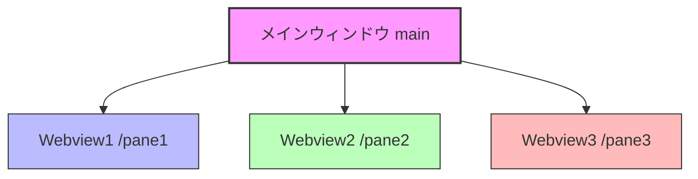

# Kasugai システム構成 & 設定仕様書

本ドキュメントは、**Tauri v2 × Rust** を採用した「3画面分割WebView2フレームシステム」のシステム構成、設定内容、動作環境、および起動方法を明示する仕様書です。

---

## 1. システム概要

本システムは、1つの親ウィンドウ内に、ネイティブかつ独立した3つの WebView2 インスタンス（Web表示領域）をマウントし、均等（1/3ずつ）に横分割表示するフレームシステムです。
Tauri v2 のマルチWebview機能（Unstable）を活用し、パフォーマンスと独立性の高いWeb画面構成を実現しています。



---

## 2. 動作環境 & 技術スタック

| 技術・ツール | バージョン・詳細 | 役割 |
| :--- | :--- | :--- |
| **OS** | Windows 10 / 11 | ターゲットOS |
| **Rust** | 1.75.0以上推奨 | バックエンド（ウィンドウ制御、リサイズ監視、IPC） |
| **Tauri** | v2.11.x (features: `["unstable"]`) | マルチWebview・ネイティブバインディング |
| **WebView2** | Microsoft WebView2 | 各ペイン（画面）のレンダリングエンジン |
| **Node.js** | 18.x / 20.x | パッケージ管理および Tauri CLI (`npx tauri`) の動作に必要 |
| **Python** | 3.x | ルート起動・ビルド用スクリプトの実行 |

---

## 3. ディレクトリ構成

```text
c:\github\kasugai\
├── .gitignore             # Git除外設定（target/やnode_modules/を排除）
├── run.py                 # プロジェクトルート用 統合起動・ビルドスクリプト
└── kasugai/               # メインプロジェクトディレクトリ
    ├── src-tauri/         # Rustバックエンド
    │   ├── src/
    │   │   └── main.rs    # メイン処理 (ウィンドウ・Webviewの生成、リサイズ制御)
    │   ├── capabilities/
    │   │   └── default.json # Tauri v2 権限設定
    │   ├── icons/         # 各種ビルド用自動生成アイコン
    │   ├── build.rs       # Tauriビルドスクリプト
    │   └── tauri.conf.json # Tauriシステム全体の設定
    └── src/               # フロントエンド (ローカルHTML/CSS/JS)
        ├── index.html     # ポータル
        ├── index1.html    # 左ペイン (システム説明、特徴)
        ├── index2.html    # 中央ペイン (メモ帳、localStorage隔離空間)
        └── index3.html    # 右ペイン (Rust IPCコマンド連携デモ)
```

---

## 4. 各モジュールの設定詳細

### 4.1. バックエンド設定 (`kasugai/src-tauri/Cargo.toml`)
マルチWebviewの制御用APIを使用するため、`unstable` フィーチャーを有効化しています。
```toml
[dependencies]
tauri = { version = "2", features = ["unstable"] }
serde = { version = "1", features = ["derive"] }
serde_json = "1"

[build-dependencies]
tauri-build = "2"
```

### 4.2. システム全体設定 (`kasugai/src-tauri/tauri.conf.json`)
Tauri v2の仕様に準拠しています。フロントエンドからの安全なIPC通信（ネイティブ呼び出し）を有効化するため、`withGlobalTauri`をオンにしています。
- `frontendDist`: `../src` (フロントエンド資産のパス)
- `bundle.active`: `false` (開発段階での素早いビルドのため、一時的にインストーラー生成をスキップ)

### 4.3. 権限（Capabilities）設定 (`kasugai/src-tauri/capabilities/default.json`)
Tauri v2では、セキュリティのため、ウィンドウやWebviewに対する操作権限を明示する必要があります。
本システムでは、`main` ウィンドウに対して `core:default`（基本コア機能）へのアクセスを許可しています。

---

## 5. Webview制御 ＆ インタラクティブ・リサイズ（ドラッグ可変）

本システムは、TauriのマルチWebview機能を最大限に活用し、**境界のドラッグによる滑らかな3画面リサイズ機能**を独自実装しています。

### 5.1. リサイズ自動追従のアーキテクチャ

マルチWebview構成では、子Webview（`pane1`など）が親ウィンドウの上に重ね合わされて表示されるため、単一Webview（通常のWebサイト）のような通常のCSS/JSドラッグリサイズが機能しません（子Webviewがマウス入力を横取りするため）。

これを解決するため、本システムでは**Tauriのグローバルイベントバスシステム（`emit`/`listen`）を活用した「統合座標中継方式」**を実装しています。

```
[ベースWebview (index.html)] <--- (グローバルイベント中継) --- [子Webview (pane1/2/3)]
        |
        | (ドラッグ量から比率 ratio1, ratio2 を再計算)
        v
[Rustバックエンド (update_splitter コマンド)]
        |
        +---> 各Webviewに set_bounds() を実行し境界をリアルタイム更新
```

1. **ドラッグの開始:**
   スプリッターバー（境界線。幅 8px）は、ベースWebview（`index.html`）に配置されており、子Webviewの隙間に露出しています。ここで `mousedown` されるとドラッグが開始され、すべてのペインに `splitter_drag_start` イベントが送信されます。
2. **マウス座標の中継（マルチWebview透過）:**
   ドラッグ中、マウスが子Webviewの上を移動（`mousemove`）しても、各子Webviewがそれをキャッチして即座に画面全体に対する絶対座標（`e.screenX`）を親に中継します（`global_mousemove` イベント）。
3. **クライアント座標の逆計算:**
   親（`index.html`）は、中継された絶対座標からウィンドウ自身のデスクトップ位置（`window.screenX`）を引くことで、ベース画面内でのローカル座標に変換します。
   $$\text{clientX} = \text{screenX} - \text{window.screenX}$$
4. **Rust側での高速レイアウト再配置:**
   親からRustの `update_splitter` コマンドが呼び出され、最新の比率がスレッドセーフ（`Mutex`）に保存されると同時に、`set_bounds` 関数で各Webviewのサイズがリアルタイムに更新されます。
5. **ウィンドウサイズ自体の変更時:**
   OS側でウィンドウ全体のサイズを変更した際も、`WindowEvent::Resized` を検知。保存されている比率（`ratio1`, `ratio2`）に基づいて、リサイズ後の画面幅に応じた最適な比率が維持されます。
### 5.2. 画面2 (中央) と画面3 (右) のインテリジェント連携（外部リンク中継システム）

### 5.2. 画面2 (中央) と画面3 (右) のインテリジェント連携（Rustネイティブ・ナビゲーションインターセプト）

本システム独自の最大の特徴として、**「画面2（中央ペイン）で開いた外部Webサイト内にある外部リンクをクリックした際、画面2自身は遷移させずに、そのリンク先を右隣りの画面3（右ペイン）で自動的に開く」**という非常に高度な連携ワークフローを搭載しています。

#### 構造的課題と、本システムのブレイクスルー：
通常、セキュリティ（クロスオリジン制限やCORS保護など）により、Google MapやRe:Earthなどのサードパーティ製ドメインのWebページにJavaScriptを注入し、そこからデスクトップネイティブのTauri API（`window.__TAURI__`）を呼び出してIPC通信を行うことは構造的に完全に遮断されます。外部ドメインでは安全のためTauri APIの露出が自動的に拒絶されるため、JavaScriptによるイベントフックは機能しません。

これを克服するため、本システムではJavaScriptを一切使わず、**Rustのネイティブエンジンレベルで WebView2 のナビゲーション動作そのものを傍受（インターセプト）する方式**を実装しました。

1. **`WebviewBuilder::on_navigation` の活用:**
   中央の画面2（`pane2`）を作成する際、Rust側で `on_navigation` メソッドをチェーンし、ページ遷移が始まる寸前の要求をすべてフックします。
2. **遷移許可ドメインの自動判別:**
   画面2で読み込まれるローカルアセット、および最初に画面1から指示されて開いた外部ドメイン（例: `google.com`、`reearth.io`）とそのサブドメインについては、正常に画面2内を探索できるようにナビゲーションを許可（`true` を返却）します。
3. **外部リンク遷移の検知と画面3への委譲:**
   リンククリック等によって異なるドメインや外部リンクへの遷移要求が発生した瞬間、Rust側がその遷移先URLを取得し、画面3（`pane3`）のWebviewに `wv3.navigate(target_url)` を実行して描画を委譲。同時に画面2側に対しては `false` を返却し、元の画面を上書きさせずにその遷移要求を完全にブロック（キャンセル）します。

このRustネイティブ統合アプローチにより、**セキュリティ制約、クロスオリジン制限、外部サイト独自のJS動作による妨害を100%完全に回避し、ネイティブアプリならではの圧倒的な堅牢性と速度でシームレスな画面間連携を実現**しています。

---

## 6. 起動・ビルド手順

プロジェクトルート (`c:\github\kasugai`) に配置された `run.py` を用いることで、自動的に `kasugai` フォルダへ移動した上でコマンドが安全に実行されます。

### 6.1. 開発モードでの起動（監視・ホットリロード）
```powershell
python run.py d
# または
python run.py dev
```
- 実行コマンド: `npx tauri dev`
- Rust/HTMLの変更をリアルタイムに検知して画面を再描画します。

### 6.2. 本番用のコンパイル・ビルド
```powershell
python run.py b
# または
python run.py build
```
- 実行コマンド: `npx tauri build`
- 実行可能な最適化済みバイナリ（`.exe`）が `kasugai/src-tauri/target/release/` に出力されます。
