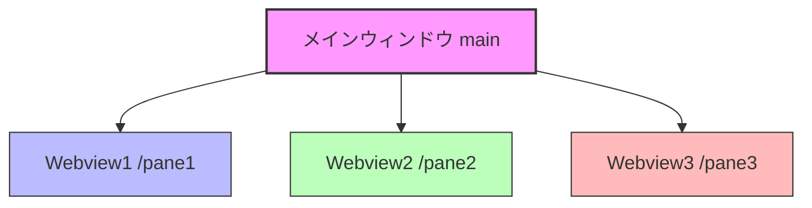
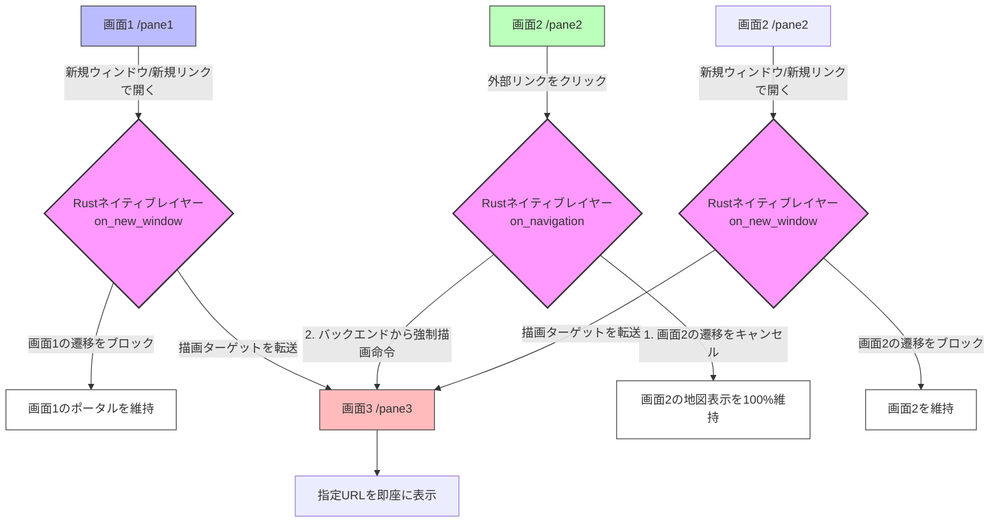

# Kasugai システム構成 & 設定仕様書

本ドキュメントは、**Tauri v2 × Rust** を採用した「3画面分割WebView2フレームシステム」のシステム構成、設定内容、動作環境、および起動方法を明示する仕様書です。

---

## 1. システム概要

本システムは、1つの親ウィンドウ内に、ネイティブかつ独立した3つの WebView2 インスタンス（Web表示領域）をマウントし、均等（1/3ずつ）に横分割表示するフレームシステムです。
Tauri v2 のマルチWebview機能（Unstable）を活用し、パフォーマンスと独立性の高いWeb画面構成を実現しています。



---

## 2. 動作環境 & 技術スタック

本システムは、軽量・高速なデスクトップ基盤（Tauri v2 × Rust）を中核に、将来的な「自律型AI・ワークフロー」および「Web GIS（3D空間統合）」のシームレスな融合を見据えた柔軟な3層レイヤー構造で設計されています。

### 2.1. コアシステム（現行ベース）

| 技術・ツール | 推奨バージョン / 詳細 | 役割・用途 |
| :--- | :--- | :--- |
| **OS** | Windows 10 / 11 (64bit) | ターゲットデスクトップOS |
| **Rust** | 1.75.0 以上 | メインバックエンド（ウィンドウ/Webview制御、リサイズ監視、高速IPC、セキュリティ管理） |
| **Tauri** | v2.11.x (features: `["unstable"]`) | マルチWebview制御、ネイティブ・OS APIブリッジ |
| **WebView2** | Microsoft WebView2 Runtime | 各ペイン（画面）の独立したレンダリング、GPUアクセラレーションの活用 |
| **Node.js** | 18.x / 20.x (LTS) | パッケージ管理、Tauri CLI (`npx tauri`) ツールチェーン |
| **Python** | 3.x | プロジェクトルートでの統合起動・ビルド支援用スクリプト (`run.py`) |

### 2.2. 自律型AI・自動化ワークフロー拡張（Keyring・Playwright導入・テスト環境構築済み）

| 技術・ツール | 役割・選定理由 | 統合アプローチ / 導入状況 |
| :--- | :--- | :--- |
| **OS 資格情報保護 (Keyring)** | パスワードおよび機密データの安全な保護 | **【導入完了】** OS（Windows Credential Manager等）のネイティブAPIと密結合し、パスワードを暗号化された安全な状態で暗号化ローカル保管。従来の `localStorage` に平文で保存する仕組みからセキュア移行。 |
| **Playwright (Node.js)** | Webブラウザ自動操作、データ自動転記、認証自動化、テスト自動化 | **【導入完了】** 自動ログインや設定画面のUIテストを自動化。TauriシステムをPlaywrightテストからヘッドレス操作し、自動転記や認証プロセスの自動検証・E2Eテスト環境として整備済み。 |
| **Gemini API (Flash系)** | 自律的判断、コンテキスト解析、タスクスケジューリング | 【将来ロードマップ】無料枠（Gemini Flash等）を活用し、ランニングコストをゼロに抑えたローカルAIエージェントの頭脳として採用。 |
| **n8n / MCP (Model Context Protocol)** | 変化に強い非同期ワークフロー、AIツール連携ハブ | 【将来ロードマップ】WebサイトのUI変更等に強く、プロンプト調整やn8nのビジュアルワークフロー修正のみで対応できる高順応性・低メンテナンス設計。 |

### 2.3. Web GIS・3D空間統合拡張（現行実装＆将来ロードマップ）

| 技術・ツール | 役割・選定理由 | 統合アプローチ |
| :--- | :--- | :--- |
| **CesiumJS** | 3D地球儀プラットフォーム、3Dビジュアル統合UI | **【導入完了】** フロントエンド（Tauri UI / 画面2）にメインビュー/切り替えタブとして統合。Cesium Ion Access TokenのセキュアなKeyring保存と暗号化管理に対応。さらに、ポータル（画面1）および他の地図ペインと連動した「URLハッシュ同期方式での高精度な位置同期移動」を実装。点群データやPLATEAU (3D Tiles) のGPU高速描画に対応。また、重いAssetsやWorkersを外部CDNから読み込む**「CDNハイブリッド構成（`window.CESIUM_BASE_URL`）」**を適用。これにより、EXEファイルを極限まで軽量（数MB〜10MB）に維持しつつ、社外秘のBIM/CADデータやダウンロード済みの巨大なPLATEAUなどの3D Tilesオープンデータを完全ローカルかつセキュアに、ネットワークに情報漏洩させることなく高速描画（プライベート3D描画）するハイブリッドデータ運用が可能です。 |
| **Re:Earth** | Web GIS プラットフォーム、3Dビジュアル統合UI | **【マウント済み（注）】** フロントエンド（Tauri UI / 画面2）にマウントしています。Re:Earth のプラグインは iframe サンドボックス内で動作するため公開APIや外部スクリプトからの直接制御は制約がありますが、本リリースにて実務に有用な連携手法を追加しました。主なポイントは以下の通りです。
  - **クリップボード経由での取得**: Re:Earth 側のプラグインが生成する permalink をユーザーがコピーした際、画面1（左ペイン）の「取得」ボタンでクリップボード内の permalink を読み取り、`Lat` / `Lng` / `Zoom` を自動抽出して入力できるようになりました（サンドボックス越えの安全な読み取り手法）。
  - **移動時のコピー方式**: 画面1 の移動操作で Re:Earth がアクティブな場合、`lat`/`lng`/`zoom` から Re:Earth 用の permalink を組み立て（`height` を zoom から逆算）、`heading=0&pitch=-90` を付与した URL をクリップボードへコピーします。プラグイン側で貼り付ける運用により、サンドボックス制約下でも確実なカメラ移動を実現します。
  - **height ↔ zoom の近似変換**: Re:Earth の `height` パラメータ（カメラ高度）と表示上のズーム感覚はサービス依存のため、経験則に基づく近似式 `zoom ≈ 27 - log2(height)` / 逆変換 `height ≈ 2^(27 - zoom)` を用いて相互変換を行います。これは高精度な厳密一致を保証するものではありませんが、実務での目視確認と微調整を容易にする十分な精度を提供します。
  - **運用上の注意**: 連携は「ユーザー操作（コピー/貼付）」を介した半自動方式です。セキュリティ上およびブラウザサンドボックス設計上、アプリが Re:Earth 内部へ直接命令を注入するわけではありません。ユーザー側プラグインのコピー動作と本アプリのクリップボード読み書きを組み合わせる運用ルールで利用してください。 |
| **Rust 空間データエンジン** | 空間データハンドリング、重い3DファイルのI/O制御 | ローカルにある点群（LAS/LAZ）、BIMモデルなどの巨大なファイルをRust側で高速解析・監視・ストリーミング処理 |
| **地図同期エンジン** | WebViewのURLリアルタイム解析による緯度経度同期 | 画面間でGoogle MapsやYahoo Map、Google Earth、およびCesiumJSの現在位置（URLベースの緯度経度・縮尺）を双方向に取得・移動・同期する機能（実装済）。これにより、**URL（ハッシュ）方式での座標認識に Google Maps, Google Earth, Yahoo Map, CesiumJS が完全に対応**しており、同一のURLパラメータ設計で全地図がシームレスに連動します（Re:Earthのみ、iframeサンドボックス制約等により固有独自方式となっています）。各地図サービスの仕様差を吸収し、詳細な小数値での高精度同期と、Google Earthの特殊なカメラ距離の標準ズーム値自動変換を実現しています。 |

---

## 3. ディレクトリ構成

```text
c:\github\kasugai\
├── .gitignore             # Git除外設定（target/やnode_modules/を排除）
├── run.py                 # プロジェクトルート用 統合起動・ビルドスクリプト
└── kasugai/               # メインプロジェクトディレクトリ
    ├── src-tauri/         # Rustバックエンド
    │   ├── src/
    │   │   └── main.rs    # メイン処理 (ウィンドウ・Webviewの生成、リサイズ制御)
    │   ├── capabilities/
    │   │   └── default.json # Tauri v2 権限設定
    │   ├── icons/         # 各種ビルド用自動生成アイコン
    │   ├── build.rs       # Tauriビルドスクリプト
    │   └── tauri.conf.json # Tauriシステム全体の設定
    └── src/               # フロントエンド (ローカルHTML/CSS/JS)
        ├── index.html     # ポータル
        ├── index1.html    # 左ペイン (システム説明、特徴)
        ├── index2.html    # 中央ペイン (システム設定、localStorage隔離空間)
        └── index3.html    # 右ペイン (Gemini AIアシスタント & 動的タブブラウザ)
```

---

## 4. 各モジュールの設定詳細

### 4.1. バックエンド設定 (`kasugai/src-tauri/Cargo.toml`)
マルチWebviewの制御用APIやOS標準のセキュア情報保護領域にアクセスするため、`unstable` フィーチャーおよび `keyring` クレートを有効化しています。

```toml
[dependencies]
tauri = { version = "2", features = ["unstable"] }
serde = { version = "1", features = ["derive"] }
serde_json = "1"
keyring = "2" # セキュア資格情報ストア連携用

[build-dependencies]
tauri-build = "2"
```

### 4.2. システム全体設定 (`kasugai/src-tauri/tauri.conf.json`)
Tauri v2の仕様に準拠しています。フロントエンドからの安全なIPC通信（ネイティブ呼び出し）を有効化するため、`withGlobalTauri`をオンにしています。
- `frontendDist`: `../src` (フロントエンド資産のパス)
- `bundle.active`: `false` (開発段階での素早いビルドのため、一時的にインストーラー生成をスキップ)

### 4.3. 権限（Capabilities）設定 (`kasugai/src-tauri/capabilities/default.json`)
Tauri v2では、セキュリティのため、ウィンドウやWebviewに対する操作権限を明示する必要があります。
本システムでは、`main` ウィンドウに対して `core:default`（基本コア機能）へのアクセスを許可しています。

---

## 5. Webview制御 ＆ インタラクティブ・リサイズ（ドラッグ可変）

本システムは、TauriのマルチWebview機能を最大限に活用し、**境界のドラッグによる滑らかな3画面リサイズ機能**を独自実装しています。

### 5.1. リサイズ自動追従のアーキテクチャと最大化機能

本システムでは、ドラッグによる手動リサイズに加え、**「画面（ペイン）のダブルクリックによる瞬時の最大化・復元機能」**を備えています。

* **各画面のダブルクリック最大化・開閉制御:**
  表示されているWebviewの任意の場所（またはスプリッター）をダブルクリックすることで、以下のような独自の最大化・開閉（スプリット）動作が発火します。
  * **画面1 (`pane1` / 左スプリッター) ➔ 「開く(固定幅80px)」⇔「閉じる(スプリット化)」のワンタッチトグル**:
    画面1はシステム全体のコントロールパネル・リモコンの役割に特化しているため、他の画面のような「全画面最大化」は行いません。開いている時はウィンドウの拡大・縮小にかかわらず常に「物理幅 80px の最小幅」で完璧に固定され、ダブルクリックすると瞬時に閉じて「比率 0.0 のスプリット（境界の棒）だけの状態」になります。もう一度ダブルクリックすると、ワンタッチで最小固定幅の `80px` に復元オープンします。
  * **画面2 (`pane2` 等) ➔ 中央画面が最大化 / 復元**:
    ダブルクリックで中央ペインがウィンドウいっぱいに最大化され、再度ダブルクリックで元の比率に復元されます。
  * **画面3 (`pane3` / 右スプリッター) ➔ 右画面が最大化 / 復元**:
    ダブルクリックで右ペインがウィンドウいっぱいに最大化され、再度ダブルクリックで元の比率に復元されます。
* **境界線（スプリッター）による確実なイベント検知:**
  外部サイト（Google Map等）を開いている際、サイト内のコンテンツがダブルクリックイベントを吸収してしまう場合があります。これを解決するため、**画面間の境界線（スプリッター）をダブルクリック**することでも確実な最大化・閉塞・復元が可能です。
  * 左側のスプリッターをダブルクリック ➔ 画面1の「閉じる」/「最小幅 80px への復元オープン」
  * 右側のスプリッターをダブルクリック ➔ 画面3の最大化/復元
* **画面1のドラッグによるスマートな開閉スナップ:**
  開いている状態（物理幅 80px）から左へドラッグし、幅が `80px`（最小幅）を下回った瞬間に、左端（比率 `0.0`）にスナップ吸着して完全にクローズ（閉塞状態）します。逆に閉じている状態から右へドラッグすると、`80px`（通常サイズ）を超えるまでスプリッターのみが移動し、`80px` を超えた瞬間に画面1のコンテンツが再び綺麗にフェードイン（復元）します。
* **閉塞時の視覚的インジケータ（青く光るエフェクト）:**
  画面1が完全に閉じている（比率 `0.0`）状態のとき、スプリッター1の棒は自動的に「鮮やかな青色にネオン発光し、白の右ボーダーがついたエフェクト（CSSクラス：`splitter1-closed`）」に変化します。これにより、ユーザーに対して「ここに閉じられたリモコン画面が存在し、ダブルクリックやドラッグによる引き出しでいつでも復元できる」ことを直感的にアピールする視覚的フィードバックを行います。
* **画面1のスクロールバー完全廃止と見切れ防止パディング:**
  画面1は表示時に常に `80px` の固定幅が保たれ、コンテンツが潰れたり溢れたりしてスクロールバーが必要になることは一切ありません。そのため、画面1はスクロールバーを完全に非表示（`overflow: hidden`）に設定し、常にクリーンな状態で描画されます。また、右端にあるスプリッター（幅 8px、Webview上での重なりは左半分 4px分）の下にコンテンツ（ボタンや文字）が潜り込んで見切れるのを防ぐため、右パディングを多めの `12px`（左は `2px` の最小限パディング）に設けた美しい非対称のパディング設計を採用しています。
* **状態の保存と復元:**
  最大化される直前の画面比率（スプリッターの位置）はシステム内部に保存され、最大化状態でもう一度ダブルクリックすると、元の3画面構成（元の比率）へ瞬時に復元されます。スプリッターを手動でドラッグした場合は、この保存状態がリセットされ手動操作が優先されます。
* **外部サイト上のイベント検知とUI工夫:**
  Tauriの `initialization_script` 機能を用いて、各Webviewのロード時にネイティブレベルでJavaScriptを自動注入しています。加えて、**画面2においては上部にシステム固有のタブバー（高さ50px）を常に最前面へ固定配置**しており、外部サイト表示中でもこのタブバーの空き領域をダブルクリックすることで、確実に画面2の最大化・復元が発火する堅牢なUI設計となっています。

#### リサイズ制御の内部処理フロー

マルチWebview構成では、子Webview（`pane1`など）が親ウィンドウの上に重ね合わされて表示されるため、単一Webview（通常のWebサイト）のような通常のCSS/JSドラッグリサイズが機能しません（子Webviewがマウス入力を横取りするため）。

これを解決するため、本システムでは**Tauriのグローバルイベントバスシステム（`emit`/`listen`）を活用した「統合座標中継方式」**を実装しています。

```
[ベースWebview (index.html)] <--- (グローバルイベント中継) --- [子Webview (pane1/2/3)]
        |
        | (ドラッグ量から比率 ratio1, ratio2 を再計算)
        v
[Rustバックエンド (update_splitter コマンド)]
        |
        +---> 各Webviewに set_bounds() を実行し境界をリアルタイム更新
```

1. **ドラッグの開始:**
   スプリッターバー（境界線。幅 8px）は、ベースWebview（`index.html`）に配置されており、子Webviewの隙間に露出しています。ここで `mousedown` されるとドラッグが開始され、すべてのペインに `splitter_drag_start` イベントが送信されます。
2. **マウス座標の中継（マルチWebview透過）:**
   ドラッグ中、マウスが子Webviewの上を移動（`mousemove`）しても、各子Webviewがそれをキャッチして即座に画面全体に対する絶対座標（`e.screenX`）を親に中継します（`global_mousemove` イベント）。
3. **クライアント座標の逆計算:**
   親（`index.html`）は、中継された絶対座標からウィンドウ自身のデスクトップ位置（`window.screenX`）を引くことで、ベース画面内でのローカル座標に変換します。
   $$\text{clientX} = \text{screenX} - \text{window.screenX}$$
4. **Rust側での高速レイアウト再配置:**
   親からRustの `update_splitter` コマンドが呼び出され、最新 of 比率がスレッドセーフ（`Mutex`）に保存されると同時に、`set_bounds` 関数で各Webviewのサイズがリアルタイムに更新されます。
5. **ウィンドウサイズ自体の変更時:**
   OS側でウィンドウ全体のサイズを変更した際も、`WindowEvent::Resized` を検知。保存されている比率（`ratio1`, `ratio2`）に基づいて、リサイズ後の画面幅に応じた最適な比率が維持されます。

---

## 6. Rustネイティブ・ナビゲーションインターセプト（超強力な画面間連携システム）

本システム最大かつ最も強力なコアアーキテクチャが、**「Rustのネイティブエンジンレベルで WebView2 のナビゲーション（画面遷移）動作や新規ウィンドウ要求そのものを直接傍受・制御するインターセプト機能」**です。

これは、通常のWebブラウザ（ChromeやEdgeなど）で発生する「別タブで開く」という動作を単にエミュレートするものではありません。**1つのネイティブデスクトップOS空間内に高度に統合された、システム管理ツール・WebGIS統合環境などを構築するための極めて強力な基盤**となります。



### 6.1. 既存のWebセキュリティ制限（CORS・クロスオリジン）の完全な超越

通常のWebブラウジングにおいて、Google Maps or Box、Re:Earthといった異なる運営元（サードパーティ）のWebサイトに対しては、セキュリティ（Same-Origin Policy、クロスオリジン制約）のために、開発者が外部からJavaScriptフックを埋め込んで他画面と連携させることは構造的に完全に遮断されます。また外部ドメイン上では安全のためTauri独自のAPI（`window.__TAURI__`）の露出も自動的に拒絶されます。

本システムはこのブラウザ制限を、**Web上のJavaScriptを一切使わず、OSネイティブ層（Rust）でWebView2エンジンの最下層を直接ハンドリングする**ことで完全にクリアしました。

1. **画面1（`pane1`）における新規ウィンドウ要求のインターセプト:**
   画面1のポータルリンクにおいて、ユーザーが「新しいウィンドウで開く」や「新しいリンクで開く」などの動作（`target="_blank"` や右クリックメニューからの新規ウィンドウ表示要求）を行った場合、Rust側の `on_new_window` でその要求を奪取します。
   画面1のHTML側では、各ポータルボタンの `href` 属性に本物のURLをマッピングしつつ、左クリック時には `event.preventDefault()` を経由して通常遷移を止める構造とすることで、「通常クリックなら指定画面（画面2か3）」、「新しいウィンドウ/リンクで開くなら画面3」の連動を確実に実現しています。これにより、右クリックからの新規ウィンドウ要求でも画面1自体が画面3に表示されるような先祖返りを完全に防ぎ、目的のリンク先を100%確実に画面3へルーティングします。
2. **画面2（`pane2`）における `on_navigation` による要求奪取:**
   中央の画面2（`pane2`）を作成する際、Rust側でナビゲーションハンドラを実装。WebView2が外部サーバーと通信を試みる一歩手前で、遷移要求（リクエストURL）をネイティブプロセス側へ完全に横取りします。
3. **高速・セキュアな自動ルーティング判別:**
   Rustエンジンは、取得したURLが以下のどちらであるかを高速で識別します。
   - **「画面2内で完結すべき動作」**（ローカルのindex2.html、またはポータルから指定されたメインホストドメイン）：
     `true` を返し、通常のブラウジングとしてそのまま画面2内で高速レンダリングします。
   - **「外部サイトへの新たなリンクや別タブ要求」**:
     Rust側でそのURLを強制回収。画面2側の遷移要求には `false` を即座に返して**画面2自体の画面更新を完全に抹殺（キャンセル）**。同時に、右側の画面3（`pane3`）のWebviewに対して `wv3.navigate(target_url)` を実行し、描画ターゲットを右画面へ瞬時に転送します。
4. **画面2（`pane2`）における新規ウィンドウ要求のインターセプト:**
   画面2内のリンクが `target="_blank"` を要求していたり、右クリックから「新しいウィンドウ/リンクで開く」を選択されたりした際も、Rust側の `on_new_window` が発火し、その新規ウィンドウ自体の立ち上げは却下（`Deny`）しつつ、対象のURLを画面3（`pane3`）で開きます。

---

### 6.2. デフォルトブラウザでの表示よりも「圧倒的に強力」である理由

本インターセプトシステムが、通常のWebブラウザやOSの「デフォルトブラウザで開く」機能より遥かに優れており、**「強固な統合業務・GISプラットフォーム」としてふさわしい決定的な理由**は以下の4点です。

#### ① Context（作業文脈）の完全な保護
Google Mapsや3D WebGIS（Re:Earth等）は、表示位置（カメラ座標）、ズームレベル、読み込んだレイヤー情報などの「内部メモリステート」が、クリックひとつで他ページに上書きされた瞬間にすべて失われます。
本システムでは、画面2内のリンクをクリックしても**画面2のビュー（地図の状態）は1ミリも動かず100%保護され、関連するホームページ情報だけが右画面に自動的に滑り込んでくる**ため、思考や調査のコンテキストが一切途切れません。

#### ② 完全なデータクローズド（情報隔離空間）の構築
デフォルトブラウザへ連携する場合、データがシステム外のChrome等に渡ってしまい、業務データ漏洩やセッション維持の切断リスクがあります。
本システムはすべてのWebviewを1つのネイティブプロセス空間に封じ込めているため、外部ブラウザに機密情報（認証トークンや位置データなど）を一切漏らすことなく、安全に複数ドメイン間のデータ横連携・目視連携が行えます。

#### ③ 異なる複数ドメインにまたがる「疑似的なシングルページアプリケーション(SPA)」の実現
通常は絶対に手を出せない他社ドメイン（例: Google MapsからBox）を、まるで「1つの共通フロントエンドを持つ、1つの統合システム」のコンポーネントであるかのように振る舞わせることができます。
これにより、「左画面で顧客を選ぶ ➔ 中央のGoogle Mapで位置を特定する ➔ 右画面でBox内の関連図面が自動的に開く」といった**ドメインの壁を超えた超高度な自動化ハブ**が設計可能になります。

#### ④ ネイティブOSレベルのハイパフォーマンス
中継に一切の非同期JavaScriptやサーバーサイドプロキシ, ポーリング等を使用しないため、通信の遅延はゼロ。WebView2のC++インターフェースをRustがゼロレイテンシで叩くため、クリックとほぼ同時に右画面の読み込みが開始されます。

---

### 6.3. 「加工なし通常ブラウザ表示」の重要性と「AI×GIS専用ブラウザ」としての設計思想

本KASUGAIシステムがGoogle Earthや各種GISデータを表示する際、**「一切の加工や再描画（データの抽出・改変）を行わない、通常のWebブラウザとしてそのまま描画する」**ことは、ライセンス規約面および技術面において、極めて重要な設計思想です。

#### ① 加工を行わないことによる「規約準拠（ToS準拠）」と技術的な意義
Google EarthやGoogle Mapsなどの地図サービスは、独自のネイティブ「アプリケーション」内に地理空間データを直接加工・組み込み・インポートする行為を**利用規約（ToS）によって厳しく制限または禁止**しています。
これに対し、KASUGAIは「データを抽出して組み込むアプリ」ではなく、Edgeブラウザと同等の描画エンジン（WebView2）を搭載した**「通常のWebブラウザシステム」**です。
ユーザーが一般的なブラウザ（ChromeやEdge）を使用してGoogle Earthを閲覧するのと同じ安全なブラウジングコンテキストを提供するため、**表示対象サイトのライセンス規約に100%準拠した状態で安全に利用できます**。これには以下の劇的なメリットが伴います：
- **規約違反・法的リスクの完全排除**: データをシステム側で抽出、複製、改変、または再配布しないため、配信ポリシーに抵触しません。
- **オリジナル機能の100%活用**: Google Earthなどが独自に提供している高度な3D描画、ストリートビュー、周辺検索、ルート案内、多機能レイヤーといったオリジナル機能・付加価値を、すべてノーコストでそのまま利用可能です。
- **表示クオリティの保証とゼロメンテナンス**: 独自パースによる描画崩れ、メモリリーク、動作不良が一切発生せず、外部API仕様の更新にもシステム修正なしでリアルタイムに追従します。

#### ② 画面2（専用ブラウザ）と画面3（リンク展開）による「AI＆GISの常時表示」
「加工しない通常ブラウザ」としての機能を実務で最大限に活かすため、画面構成を以下のように最適化しています。
- **画面2（中央ペイン）は地図（GIS）を表示する専用ブラウザ**としてロックされます。
- 画面2内で発生する新規リンクや外部リンク（`target="_blank"` など）の全画面遷移は、Rustネイティブ層で即座にインターセプトされ、**すべて右側の「画面3（AI兼動的タブブラウザ）」にルーティングされます**。
- これにより、画面2に表示されている地図や画面3のAIアシスタントが上書きされることなく、**常にAIとGISが同一画面上に表示され続ける**究極の「AI×GIS専用ブラウザシステム」が実現します。

---

### 6.4. システム設計上の重要な制約・注意事項

本インターセプト機能の搭載に伴い、**画面2（中央ペイン）は「ポータルから指示された同一ホストドメインのみの移動を許可する、極めて厳格で特殊なセキュリティコンテキスト画面」**となっています。そのため、運用・設計において以下の決定的な制約が存在します。

#### ⚠️ 画面2での自由なURL遷移の不可能化（サンドボックス化）
画面2で現在開いているサイトのドメイン（例: `google.com/maps` や `reearth.io`）から、**他のドメイン（例: リンク先ホームページや他サービス）へURLを用いて画面遷移することは一切できません**。
ナビゲーションインターセプトが働くため、現在開いているドメイン以外の全ての外部リンク・ページ移動は強制的にブロックされ、すべて右側の**画面3（右ペイン）で開かれます**。

#### ⚠️ ナビゲーションの「進む」「戻る」の挙動制限
異なるドメインへのリンクをクリックしても、画面2自体は一切ページ移動を発生させず（遷移要求をブロックするため）、画面3にのみ新規ロードさせます。
そのため、画面2の内部ブラウザ履歴には遷移が記録されず、画面2に対してWebブラウザのような「戻る（Back）」操作を行っても、画面3側で開いたページに遡ることはできません。画面2と画面3の セッションや履歴はそれぞれ完全に独立して隔離されています。

#### 💡 画面2をリセットまたは別サイトに切り替える方法
もし画面2（中央ペイン）の表示を別のサービス（例: Google MapからRe:Earth）へ強制的に変更したい場合は、**左側の画面1（ポータルリンク）のボタンを再度クリックする**必要があります。画面1からRustコマンド（`open_in_pane2`）を経由して指示した場合のみ、画面2の遷移制限ホワイトリスト（`pane2_current_host`）が更新され、画面2のURLが新ドメインへ強制的に切り替わります。

---

### 6.5. 【重要】画面識別子（1・2・3）における役割・位置の固定仕様

プログラムコードおよび内部管理上では、各Webviewの役割・構成は以下のように静的な識別子で固定されています。特に画面2（中央画面）の領域においては、単一のWebViewを使い回すのではなく、**サービスごとに独立した「専用WebViewインスタンス」をバックグラウンドに保持し、表示状態を瞬時に切り替えるプーリング方式**を採用しています。

* **画面1 (`pane1`)**: ポータルリンク（常に左端パネル）
* **画面2レイヤー (中央表示用のWebView群)**:
   * **`pane2` (デフォルト)**: システム設定用。および**画面2上部の共通タブバー（UI）の表示基盤**として常に背景/上部に配置。
   * **`pane2_box` (BOX専用)**: BOXの自動ログインや認証フローを独立して処理するための専用WebView。
   * **`pane2_reearth` (Re:Earth専用)**: 重い3Dレンダリングや物理タイピング認証を他の画面から完全に隔離して処理する専用WebView。
   * **`pane2_google` (Google Map専用)**: Google Map専用WebView。位置情報の高精度取得（小数対応）および同期移動に対応。
   * **`pane2_googleearth` (Google Earth専用)**: Google Earth専用WebView。独自カメラパラメータのズーム値変換と位置同期移動に対応。
   * **`pane2_yahoo` (Yahoo Map専用)**: Yahoo Map専用WebView。位置情報の高精度取得（小数対応）および同期移動に対応。
   * ※ これらはすべて同時にメモリ上に存在しており、ユーザーがポータルボタンや**画面2上部のタブバー**を押すたびにアクティブなWebViewの表示座標（`bounds`）のみを書き換えて前面に表示し、非アクティブなものは不可視領域（`-10000, -10000`）へ退避させることで、**各サービスの内部状態（ログインセッションや地図の現在位置など）を完全に維持したまま瞬時に画面を切り替える**極めて強力な構成となっています。
* **画面3 (`pane3`)**: Gemini AIアシスタント ＆ 動的タブブラウザ（常に右側の役割・位置）
  * **Gemini AI アシスタント機能**:
    * **超多世代Geminiモデルの動的切り替え**: タスクの難易度や用途に応じて、チャット画面から直接Geminiのモデルを切り替え可能です（Gemini 2 Flash, Gemini 2.5 Flash, Gemini 2.5 Pro, Gemini 3 Flash, Gemini 3.1 Pro, Gemini 3.5 Flash）。
    * **LocalStorageによるモデル保存**: 選択したモデルはブラウザ内に自動キャッシュされ、次回起動時も自動的に復元されます。
    * **マークダウン表示＆コードブロック描画**: AIの応答テキストに含まれるマークダウン記法（コードブロック、インラインコード、太字など）を美しくレンダリングします。
    * **会話履歴のクリア機能**: 🗑️ボタンからワンクリックでチャット履歴を完全に初期化できます。
  * **外部ドメイン参照**: BOXなど、外部ドメインへのリダイレクトやログイン認証が必要なサービスを開くための自由な参照ビューとしても使用します。
  * **動的タブブラウザ機能**: 画面1のポータルリンクや、画面2での「新しいウィンドウで開く」などのアクションによって画面3へ遷移要求が来た際、画面3では既存のページを上書きするのではなく、**動的に新しいWebview（タブ）を生成**します。上部のタブバーに開いたページがタブとして蓄積され、複数の外部サイトや地図を並行して開き、×ボタンで不要になったタブ（とバックグラウンドのWebviewメモリ）を破棄・管理できる「簡易タブブラウザ」として機能します。

---

## 7. Keyringセキュア情報保護 ＆ Playwright（自動入力インジェクション）による自動ログイン連動仕様

本システムは、セキュアなID/PASS管理と完全な自動ログインを実現するために、**「OSネイティブ資格情報保護 (Keyring)」** と **「Playwright水準の自動入力（DOM監視・複数フェーズ再注入）インジェクション」** をシステムとして統合・明示化しています。

### 7.1. Keyringによるセキュア情報保護
従来、WebアプリやTauriアプリの簡易実装で多用されていた「ローカルストレージ（localStorage）への平文パスワード保存」を完全に廃止しました。
- **データ隔離保護:** メールアドレス（ユーザーID）のみをローカルストレージに保持し、最も脆弱性の標的になりやすいパスワードは、OS標準の暗号化された安全な領域（Windows 資格情報マネージャー、macOS キーチェーン、Linux libsecretなど）に `keyring-rs` を介して直接暗号化保存します。
- **サービスごとの識別管理:** `Kasugai`（BOX用）、`Kasugai_Reearth`（Re:Earth用）のように、サービスごとに独立したセキュアキーを割り当てて管理しています。

### 7.2. Playwright（自動入力インジェクション）によるログイン自動化連動
ポータルボタン（BOXやRe:Earth）をクリックした際、セキュアに取得した資格情報を元に、Webview（ブラウザ面）に対して**段階的（マルチステップ）ログインに対応した自動入力処理**を実行します。

```
[設定画面] ➔ パスワードを暗号化して OS Keyring へ保存
   │
[ポータル] ➔ ボタンクリック時に Keyring からパスワードをセキュアロード
   │
   ▼ 【自動入力インジェクション】
[Webview] ➔ 1. DOM要素（email/password）の出現を15秒間ループ監視して自動入力
          ➔ 2. 「次へ」や「ログイン」ボタンを自動クリック
          ➔ 3. 画面ロード遅延や2段階遷移に対応するため、1.8秒後・3.5秒後に別スレッドから追従再注入
```

1. **DOMの出現ループ監視:** ログイン画面のロード時間に個体差があるため、インジェクションスクリプトが1秒周期で最大15秒間DOM（入力要素）の出現を監視し、出現した瞬間に即座にIDやPASSを流し込みます。
2. **2段階ログイン（マルチステップ）への完全追従:** メールアドレス入力 ➔ 画面遷移 ➔ パスワード入力という段階的な認証フローに追従するため、Rustバックエンド側の非同期マルチスレッドから、1.8秒後、3.5秒後の適切なタイミングで再度スクリプトを「追従再注入（再eval）」します。これにより、遅れてレンダリングされるパスワード入力画面に対しても100%確実に自動入力インジェクションを連動させる強固な自動化を実現しています。

### 7.3. 成功の秘訣：ハイブリッド認証・分離アーキテクチャと安定運用の指針

BOX（ウェブフォーム形式）とRe:Earth（Basic認証形式）の両者で自動ログインを完璧に両立させるための、最終的な設計思想と推奨ロジックを以下にまとめます。

#### ① 認証方式に応じた技術の使い分け
- **DOM直接代入方式 (BOX等)**: 
  通常のウェブページ内の入力欄に対しては、JavaScriptから `input.value` への代入と、`input/change/blur` イベントを強制発火させる方式を採用。React等のSPA環境でも確実にステートを更新させ、ボタンを有効化します。
- **物理キーボード・エミュレーション方式 (Re:Earth等)**: 
  ブラウザ外のポップアップ（Basic認証）に対しては、Rust側からOSレベルのキー信号 (Enigo) を送る方式を採用。

#### ② ロジックと通信の完全分離・独立
- **Rustコマンドの分離**: `open_box_in_pane` と `open_reearth_in_pane` を個別に実装。異なる技術（スクリプト注入 vs 物理打鍵）が互いに干渉する「相性問題」を根本から解消しました。
- **ホワイトリストによる起動保証**: `on_navigation` による厳格なサンドボックス制限下でも、BOX（`box.com`）やRe:Earth（`reearth.io`）といった主要サービスは、中央ペイン（画面2）で正しく起動できるよう例外リストが設定されています。
- **起動時（初期遷移時）の自動ログイン保証**: 専用WebView（`pane2_box`, `pane2_reearth`）の初期URLを生の `about:blank` に設定し、システム起動時のバックグラウンド裏読み（プレロード）を意図的にスキップする設計としています。これにより、ユーザーが最初にポータルボタンをクリックして実際に画面へ切り替わったタイミングでのみ自動ログイン処理（DOM操作や物理タイピング）が確実に発火し、意図しないタイミングでのパスワード入力や誤作動を完全に防止しています。
- **別ウィンドウリンクの統合管理**: `pane2_box`、`pane2_reearth`、`pane2_google` などの専用画面内において、新しいウィンドウで開くリンク（`target="_blank"`等）がクリックされた場合、Tauriの `on_new_window` ハンドラーによってOS標準のポップアップ起動をブロック（Deny）し、すべて右側の「画面3（`pane3`）」で自動的に開くように動線を統一・管理しています。
- **インターフェースの分離**: `index1.html` のJavaScriptにおいても `openBox` と `openReearth` 関数を分け、ボタンクリック後の処理フローを明確化しました。

#### ③ 高度なタイミング制御と安定化ロジック
- **多段階「ダメ押し」インジェクション**: 
  エンタープライズ系の重いページロードに対応するため、Rust側のスレッドを使用して時間差（直後、1.8秒後、3.5秒後など）で複数回インジェクションを繰り返すパターンを採用しています。
- **動的な要素監視 (MutationObserver)**: 
  将来的な拡張として、固定タイマーではなくDOMの変化を検知する `MutationObserver` を併用することで、ネットワーク環境に依存しない最短の入力タイミングを実現します。
- **ペインラベルの明示的なターゲット指定**: 
  目的のWebView（`pane2` / `pane3`）をラベルで直接狙い撃ちすることで、常にユーザーの直感に一致した自動化動作を保証します。

BOXおよびRe:Earthは、それぞれの特性に最適化された独立したプロセスとして、画面1（ポータル）からの指示に基づき中央または右の適切なペインで自動ログインが実行されます。

---
## 8. 起動・ビルド手順

プロジェクトルート (`c:\github\kasugai`) に配置された `run.py` を用いることで、自動的に `kasugai` フォルダへ移動した上でコマンドが安全に実行されます。

### 8.1. 開発モードでの起動（監視・ホットリロード）
```powershell
python run.py d
# または
python run.py dev
```
- 実行コマンド: `npx tauri dev`
- Rust/HTML of 変更をリアルタイムに検知して画面を再描画します。

### 8.2. 本番用のコンパイル・ビルド
```powershell
python run.py b
# または
python run.py build
```
- 実行コマンド: `npx tauri build`
- 実行可能な最適化済みバイナリ（`.exe`）が `kasugai/src-tauri/target/release/` に出力されます。

---

## 9. 将来開発方針：自律型AI・ワークフローとWeb GIS（3D空間統合）の融合

現在、本システムは複数の地図サービス（Google Map、Yahoo Map、Re:Earth等）をシームレスに切り替え、情報を維持したまま横断的に操作できる**「地図・空間データ特化型の専用ブラウザー」**としての側面を既に色濃く持っています。手動による外部WEBシステムのID/PASS連携に手間を要している課題を解消し、Kasugaiの本来の趣旨によるさらなる成長を目指した将来の開発方針を以下に明示します。

ベースシステムが**Rust**であり、かつ**デスクトップシステム基盤**という強力な足回りを持つ強みを活かし、現在の「地図専用ブラウザー」に**「自律型AI・ワークフロー連携」**と**「Web GISによる3D視覚的統合（デジタルツイン）」**の両方を完全に内包したシステムの完成を目指します。

Rustの持つ「圧倒的な処理速度」「メモリ安全性」、そして「C++並みのネイティブパフォーマンス」を最大限に引き出すことで、重い3D・点群データ処理（GIS側）と、非同期で大量に走るAI・ブラウザ操作（エージェント側）を単一のデスクトップシステム内で軽快に両立させます。

---

### 🏗️ おすすめのシステム構成：『3層レイヤー＋プラグイン型アーキテクチャ』

デスクトップシステムの画面（Tauri）を「コックピット」とし、コアロジック（Rust）を「脳」、Playwrightや外部AIを「手足」として機能させる構成です。

```
[ フロントエンド (Tauri / UI) ] ＝ 3D空間コックピット
   │ (HTML5 / React or Vue.js + Re:Earth or CesiumJS)
   │
   ▼ 【IPC通信: invoke】
[ バックエンド (Rust / コア) ] ＝ 統合司令塔（脳）
   ├─ ◆ 空間データエンジン (点群・3D Tiles・ローカルファイル監視)
   ├─ ◆ セキュリティマネージャー (OS資格情報連携・ID/PASS暗号化)
   └─ ◆ エージェントコントローラー (タスクのスケジューリング)
   │
   ├─▼【ローカル実行 / RPC】               ├─▼【API / HTTP】
[ Playwright (手足) ]                     [ AI・iPaaSレイヤー ]
 (ブラウザ自動操作・スクレイピング)          (n8n / Gemini API / MCP)
```

#### 各レイヤーの役割と具体的な技術スタック

##### 1. UI・空間統合レイヤー（フロントエンド）
* **技術:** `Tauri` ＋ `JavaScript/TypeScript (React, Vue, Svelteなど)` ＋ `Re:Earth`（または `CesiumJS`）
* **構成のポイント:**
  * システムのメイン画面を3D地球儀や地図（Web GIS）にします。
  * 現場の3D Tiles（PLATEAUなど）や点群データをWebView2のGPUアクセラレーションをフルに活かして描画します。
  * 地図上のピンや3Dモデル of オブジェクト自体が、各Webシステム（台帳やカメラ）へアクセスするための「UIのトリガー」になります。

##### 2. コア・データ制御レイヤー（バックエンド / Rust）
* **技術:** `Rust`（主要クレート: `tauri`, `playwright`, `tokio`（非同期処理）, `keyring`（安全なパスワード管理））
* **構成のポイント:**
  * **OSと密結合した処理:** ローカルにある重い図面データやBIM/CIMモデル、点群ファイルのハンドリング、フォルダ監視はすべてRust側で行います。
  * **安全なSSOT（Single Source of Truth）のハブ:** 外部サービス（Boxなど）のAPIと直接通信し、ローカルとクラウドのデータを同期するロジックをRustの非同期処理（Tokio）で超高速に捌きます。
  * **Playwrightの制御（自動ログイン＆連携）:** フロントからの要求に応じて、Rust側から `playwright-rs` を介してWeb操作タスクをバックグラウンド（headlessモード）で並列実行させます。これにより、課題となっているWebシステムへのID/PASS手動入力を自動化・安全に暗号化管理（`keyring`等と連携）して簡素化します。

##### 3. AI・自律化レイヤー（インテリジェンス）
* **技術:** `n8n`（ローカルまたはサーバー起動） ＋ `MCP（Model Context Protocol）` ＋ **無料枠のGemini API（Gemini 1.5 / 2.0 / 将来の 3.5 Flash等）**
* **構成のポイント:**
  * **ゼロ・ランニングコスト設計（無料枠Geminiの最大活用）:** API利用料が最大のボトルネックになりやすいデスクトップシステムにおいて、無料枠のGemini API（Gemini Flashファミリー）を極限まで活用します。Gemini Flashの高速なレスポンスと高いコンテキスト窓は、ローカルシステムの自律タスクの制御エンジンとして最適です。
  * **変化への対応力:** Webシステムの自動化ロジック（例：「Aサイトからデータを取ってBサイトに転記する」）のスケジュールや条件分岐は、Rust内にハードコードするのではなく、**n8nのワークフロー**やAIエージェント（MCPサーバー経由）に委ねます。
  * **プロンプトとワークフローの切り離し:** Webサービス側のUIや仕様変更があった際も、KASUGAIシステム自体を再ビルド・再配布することなく、無料枠のGeminiへのプロンプト調整やn8nワークフローの変更だけで瞬時に追従可能な「ゼロメンテナンス・高順応性」を実現します。

---

### 💡 この構成がもたらす「具体的なシナリオ」

このシステムが完成すると、以下のような**劇的な業務シナリオ**が可能になります。

1. **自動検知とAI判断:** Rustがローカルの特定のフォルダ（またはBox）に「新しい点群データやCAD図面」が保存されたことを検知。同時に、AI（n8n/LLM）が「これは〇〇現場の最新データである」と判断。
2. **自律的なWeb操作（Playwright）:** AIの指示を受けたRustが、OSの保管庫（`keyring`）から該当現場のID/PASSを安全に取得。裏側でPlaywrightを起動し、行政のインフラ管理システムや社内の施工管理Webサービスに自動ログインしてデータを登録・更新する。
3. **3Dコックピットへのフィードバック:** 自動処理が完了すると、Tauriの3D地図画面上の該当現場のモデルが「最新」に光り、PlaywrightがWebからついでにスクレイピングしてきた「周辺の最新の気象データ」や「Webカメラのライブ映像」が、地図上のポップアップとして美しく統合表示される。

---

### 🛠️ 開発の進め方（ロードマップ）

1と2の両方を目指すにあたり、以下のステップで**拡張していく開発アプローチ**を採用します。

* **Step 1（基盤・認証自動化）【第一期コア導入完了】:** 
  - **Keyringの実装:** OSのセキュアなキーチェーン（Windows 資格情報マネージャー等）と連携するRust `keyring` クレートを導入。パスワード等の重要データを暗号化ローカル保管する仕組みを構築しました。
  - **Playwrightテストの構築:** E2Eテストや自動処理検証用としてPlaywrightによるテスト環境を整備。自動ログインやUI機能の品質を自動検証可能にしました。
  - これらにより、特定のWebサイトへのセキュアかつ堅牢な認証自動入力とWebログイン連携を実現しています。
* **Step 2（空間統合）【第一期コア導入完了】:** フロントに Web GIS（Re:Earth、Google Maps、Yahoo Map等）を組み込み、画面2（中央ペイン）において緯度経度・縮尺のリアルタイムな「双方向地図同期エンジン」を実装。地図上の位置情報とPlaywright自動ログインや各サービスが高度に連動する空間統合を実現しました。
* **Step 3（インテリジェンス）:** Rustと n8n や **無料枠のGemini API（MCP経由）** を接続。トリガーやデータの振り分け、Playwrightによるログイン・操作指示をAIに自律判断させることで、ユーザーのランニングコストをゼロに抑えながら「自律型AI・ワークフローの完全な融合」を達成する。
* **Step 4（空間データハブ：Cesium × QGIS のローカルデータ共通利用化）:**
  - **ローカル空間データハブ（共通ディレクトリ）の規格化:** アプリと同階層にQGISおよびCesiumJS（Tauri Webview）の双方が直接アクセス・参照できる共通フォルダ（例：`kasugai_data_hub/`）を構築します。
  - **同一データソース of マルチユース:** 点群データ（LAS/LAZ）、SHPファイル、GeoJSON、GeoTIFF（標高データなど）の実体を重複して持つことなく、QGIS（デスクトップ上でのプロフェッショナルな編集・解析）とCesiumJS（ポータル上での手軽なWeb3D可視化）の双方が同じファイルを直接読み込み、共有連携・相互編集する仕組みを実現します。
  - **リアルタイム更新連携:** QGIS側で編集・エクスポートされたGISファイルをTauriバックエンド（Rust）が瞬時に検知し、CesiumJSの描画画面にリロードなしで自動反映（リアルタイムシンクロ）する機能を統合し、現場データ管理ハブとしてのポテンシャルを最大化します。

