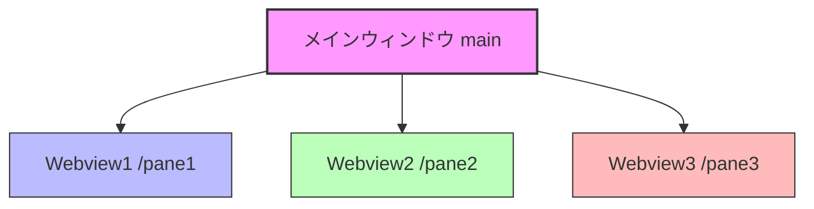
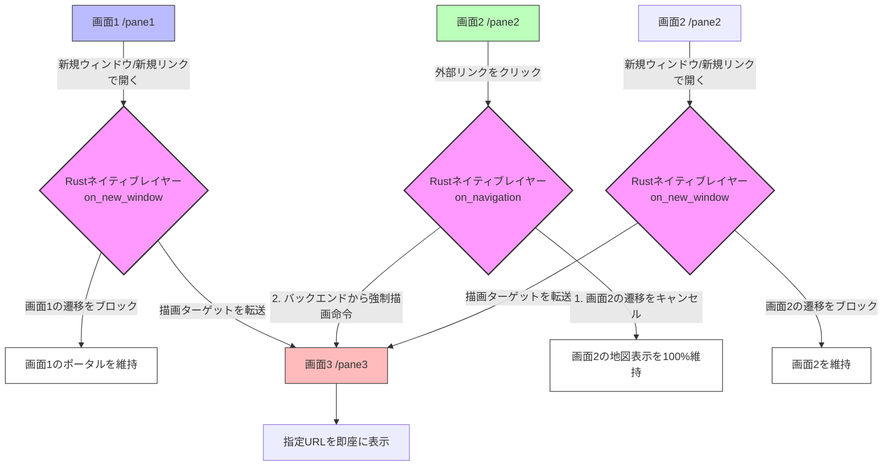

# Kasugai システム構成 & 設定仕様書

本ドキュメントは、**Tauri v2 × Rust** を採用した「3画面分割WebView2フレームシステム」のシステム構成、設定内容、動作環境、および起動方法を明示する仕様書です。

---

## 1. システム概要

本システムは、1つの親ウィンドウ内に、ネイティブかつ独立した3つの WebView2 インスタンス（Web表示領域）をマウントし、均等（1/3ずつ）に横分割表示するフレームシステムです。
Tauri v2 のマルチWebview機能（Unstable）を活用し、パフォーマンスと独立性の高いWeb画面構成を実現しています。




---

## 2. 動作環境 & 技術スタック

本システムは、軽量・高速なデスクトップ基盤（Tauri v2 × Rust）を中核に、将来的な「自律型AI・ワークフロー」および「Web GIS（3D空間統合）」のシームレスな融合を見据えた柔軟な3層レイヤー構造で設計されています。

### 2.1. コアシステム（現行ベース）
| 技術・ツール | 推奨バージョン / 詳細 | 役割・用途 |
| :--- | :--- | :--- |
| **OS** | Windows 10 / 11 (64bit) | ターゲットデスクトップOS |
| **Rust** | 1.75.0 以上 | メインバックエンド（ウィンドウ/Webview制御、リサイズ監視、高速IPC、セキュリティ管理） |
| **Tauri** | v2.11.x (features: `["unstable"]`) | マルチWebview制御、ネイティブ・OS APIブリッジ |
| **WebView2** | Microsoft WebView2 Runtime | 各ペイン（画面）の独立したレンダリング、GPUアクセラレーションの活用 |
| **Node.js** | 18.x / 20.x (LTS) | パッケージ管理、Tauri CLI (`npx tauri`) ツールチェーン |
| **Python** | 3.x | プロジェクトルートでの統合起動・ビルド支援用スクリプト (`run.py`) |

### 2.2. 自律型AI・自動化ワークフロー拡張（Keyring・Playwright導入・テスト環境構築済み）
| 技術・ツール | 役割・選定理由 | 統合アプローチ / 導入状況 |
| :--- | :--- | :--- |
| **OS 資格情報保護 (Keyring)** | パスワードおよび機密データの安全な保護 | **【導入完了】** OS（Windows Credential Manager等）のネイティブAPIと密結合し、パスワードを暗号化された安全な状態で暗号化ローカル保管。従来の `localStorage` に平文で保存する仕組みからセキュア移行。 |
| **Playwright (Node.js)** | Webブラウザ自動操作、データ自動転記、認証自動化、テスト自動化 | **【導入完了】** 自動ログインや設定画面のUIテストを自動化。TauriアプリをPlaywrightテストからヘッドレス操作し、自動転記や認証プロセスの自動検証・E2Eテスト環境として整備済み。 |
| **Gemini API (Flash系)** | 自律的判断、コンテキスト解析、タスクスケジューリング | 【将来ロードマップ】無料枠（Gemini Flash等）を活用し、ランニングコストをゼロに抑えたローカルAIエージェントの頭脳として採用。 |
| **n8n / MCP (Model Context Protocol)** | 変化に強い非同期ワークフロー、AIツール連携ハブ | 【将来ロードマップ】WebサイトのUI変更等に強く、プロンプト調整やn8nのビジュアルワークフロー修正のみで対応できる高順応性・低メンテナンス設計。 |

### 2.3. Web GIS・3D空間統合拡張（将来ロードマップ対応）
| 技術・ツール | 役割・選定理由 | 統合アプローチ |
| :--- | :--- | :--- |
| **Re:Earth / CesiumJS** | Web GIS / 3D地球儀プラットフォーム、3Dビジュアル統合UI | フロントエンド（Tauri UI）のメインビューとして統合。点群データ、PLATEAU (3D Tiles)、BIM/CIMをGPU支援により高速描画 |
| **Rust 空間データエンジン** | 空間データハンドリング、重い3DファイルのI/O制御 | ローカルにある点群（LAS/LAZ）、BIMモデルなどの巨大なファイルをRust側で高速解析・監視・ストリーミング処理 |

---

## 3. ディレクトリ構成

```text
c:\github\kasugai\
├── .gitignore             # Git除外設定（target/やnode_modules/を排除）
├── run.py                 # プロジェクトルート用 統合起動・ビルドスクリプト
└── kasugai/               # メインプロジェクトディレクトリ
    ├── src-tauri/         # Rustバックエンド
    │   ├── src/
    │   │   └── main.rs    # メイン処理 (ウィンドウ・Webviewの生成、リサイズ制御)
    │   ├── capabilities/
    │   │   └── default.json # Tauri v2 権限設定
    │   ├── icons/         # 各種ビルド用自動生成アイコン
    │   ├── build.rs       # Tauriビルドスクリプト
    │   └── tauri.conf.json # Tauriシステム全体の設定
    └── src/               # フロントエンド (ローカルHTML/CSS/JS)
        ├── index.html     # ポータル
        ├── index1.html    # 左ペイン (システム説明、特徴)
        ├── index2.html    # 中央ペイン (メモ帳、localStorage隔離空間)
        └── index3.html    # 右ペイン (Rust IPCコマンド連携デモ)
```

---

## 4. 各モジュールの設定詳細

### 4.1. バックエンド設定 (`kasugai/src-tauri/Cargo.toml`)
マルチWebviewの制御用APIを使用するため、`unstable` フィーチャーを有効化しています。
```toml
[dependencies]
tauri = { version = "2", features = ["unstable"] }
serde = { version = "1", features = ["derive"] }
serde_json = "1"

[build-dependencies]
tauri-build = "2"
```

### 4.2. システム全体設定 (`kasugai/src-tauri/tauri.conf.json`)
Tauri v2の仕様に準拠しています。フロントエンドからの安全なIPC通信（ネイティブ呼び出し）を有効化するため、`withGlobalTauri`をオンにしています。
- `frontendDist`: `../src` (フロントエンド資産のパス)
- `bundle.active`: `false` (開発段階での素早いビルドのため、一時的にインストーラー生成をスキップ)

### 4.3. 権限（Capabilities）設定 (`kasugai/src-tauri/capabilities/default.json`)
Tauri v2では、セキュリティのため、ウィンドウやWebviewに対する操作権限を明示する必要があります。
本システムでは、`main` ウィンドウに対して `core:default`（基本コア機能）へのアクセスを許可しています。

---

## 5. Webview制御 ＆ インタラクティブ・リサイズ（ドラッグ可変）

本システムは、TauriのマルチWebview機能を最大限に活用し、**境界のドラッグによる滑らかな3画面リサイズ機能**を独自実装しています。

### 5.1. リサイズ自動追従のアーキテクチャ

マルチWebview構成では、子Webview（`pane1`など）が親ウィンドウの上に重ね合わされて表示されるため、単一Webview（通常のWebサイト）のような通常のCSS/JSドラッグリサイズが機能しません（子Webviewがマウス入力を横取りするため）。

これを解決するため、本システムでは**Tauriのグローバルイベントバスシステム（`emit`/`listen`）を活用した「統合座標中継方式」**を実装しています。

```
[ベースWebview (index.html)] <--- (グローバルイベント中継) --- [子Webview (pane1/2/3)]
        |
        | (ドラッグ量から比率 ratio1, ratio2 を再計算)
        v
[Rustバックエンド (update_splitter コマンド)]
        |
        +---> 各Webviewに set_bounds() を実行し境界をリアルタイム更新
```

1. **ドラッグの開始:**
   スプリッターバー（境界線。幅 8px）は、ベースWebview（`index.html`）に配置されており、子Webviewの隙間に露出しています。ここで `mousedown` されるとドラッグが開始され、すべてのペインに `splitter_drag_start` イベントが送信されます。
2. **マウス座標の中継（マルチWebview透過）:**
   ドラッグ中、マウスが子Webviewの上を移動（`mousemove`）しても、各子Webviewがそれをキャッチして即座に画面全体に対する絶対座標（`e.screenX`）を親に中継します（`global_mousemove` イベント）。
3. **クライアント座標の逆計算:**
   親（`index.html`）は、中継された絶対座標からウィンドウ自身のデスクトップ位置（`window.screenX`）を引くことで、ベース画面内でのローカル座標に変換します。
   $$\text{clientX} = \text{screenX} - \text{window.screenX}$$
4. **Rust側での高速レイアウト再配置:**
   親からRustの `update_splitter` コマンドが呼び出され、最新 of 比率がスレッドセーフ（`Mutex`）に保存されると同時に、`set_bounds` 関数で各Webviewのサイズがリアルタイムに更新されます。
5. **ウィンドウサイズ自体の変更時:**
   OS側でウィンドウ全体のサイズを変更した際も、`WindowEvent::Resized` を検知。保存されている比率（`ratio1`, `ratio2`）に基づいて、リサイズ後の画面幅に応じた最適な比率が維持されます。

---

## 6. Rustネイティブ・ナビゲーションインターセプト（超強力な画面間連携システム）

本システム最大かつ最も強力なコアアーキテクチャが、**「Rustのネイティブエンジンレベルで WebView2 のナビゲーション（画面遷移）動作や新規ウィンドウ要求そのものを直接傍受・制御するインターセプト機能」**です。

これは、通常のWebブラウザ（ChromeやEdgeなど）で発生する「別タブで開く」という動作を単にエミュレートするものではありません。**1つのネイティブデスクトップOS空間内に高度に統合された、システム管理ツール・WebGIS統合環境などを構築するための極めて強力な基盤**となります。



### 6.1. 既存のWebセキュリティ制限（CORS・クロスオリジン）の完全な超越

通常のWebブラウジングにおいて、Google Maps or Box、Re:Earthといった異なる運営元（サードパーティ）のWebサイトに対しては、セキュリティ（Same-Origin Policy、クロスオリジン制約）のために、開発者が外部からJavaScriptフックを埋め込んで他画面と連携させることは構造的に完全に遮断されます。また外部ドメイン上では安全のためTauri独自のAPI（`window.__TAURI__`）の露出も自動的に拒絶されます。

本システムはこのブラウザ制限を、**Web上のJavaScriptを一切使わず、OSネイティブ層（Rust）でWebView2エンジンの最下層を直接ハンドリングする**ことで完全にクリアしました。

1. **画面1（`pane1`）における新規ウィンドウ要求のインターセプト:**
   画面1のポータルリンクにおいて、ユーザーが「新しいウィンドウで開く」や「新しいリンクで開く」などの動作（`target="_blank"` や右クリックメニューからの新規ウィンドウ表示要求）を行った場合、Rust側の `on_new_window` でその要求を奪取します。
   画面1のHTML側では、各ポータルボタンの `href` 属性に本物のURLをマッピングしつつ、左クリック時には `event.preventDefault()` を経由して通常遷移を止める構造とすることで、「通常クリックなら指定画面（画面2か3）」、「新しいウィンドウ/リンクで開くなら画面3」の連動を確実に実現しています。これにより、右クリックからの新規ウィンドウ要求でも画面1自体が画面3に表示されるような先祖返りを完全に防ぎ、目的のリンク先を100%確実に画面3へルーティングします。
2. **画面2（`pane2`）における `on_navigation` による要求奪取:**
   中央の画面2（`pane2`）を作成する際、Rust側でナビゲーションハンドラを実装。WebView2が外部サーバーと通信を試みる一歩手前で、遷移要求（リクエストURL）をネイティブプロセス側へ完全に横取りします。
3. **高速・セキュアな自動ルーティング判別:**
   Rustエンジンは、取得したURLが以下のどちらであるかを高速で識別します。
   - **「画面2内で完結すべき動作」**（ローカルのindex2.html、またはポータルから指定されたメインホストドメイン）：
     `true` を返し、通常のブラウジングとしてそのまま画面2内で高速レンダリングします。
   - **「外部サイトへの新たなリンクや別タブ要求」**:
     Rust側でそのURLを強制回収。画面2側の遷移要求には `false` を即座に返して**画面2自体の画面更新を完全に抹殺（キャンセル）**。同時に、右側の画面3（`pane3`）のWebviewに対して `wv3.navigate(target_url)` を実行し、描画ターゲットを右画面へ瞬時に転送します。
4. **画面2（`pane2`）における新規ウィンドウ要求のインターセプト:**
   画面2内のリンクが `target="_blank"` を要求していたり、右クリックから「新しいウィンドウ/リンクで開く」を選択されたりした際も、Rust側の `on_new_window` が発火し、その新規ウィンドウ自体の立ち上げは却下（`Deny`）しつつ、対象のURLを画面3（`pane3`）で開きます。

---

### 6.2. デフォルトブラウザでの表示よりも「圧倒的に強力」である理由

本インターセプトシステムが、通常のWebブラウザやOSの「デフォルトブラウザで開く」機能より遥かに優れており、**「強固な統合業務・GISプラットフォーム」としてふさわしい決定的な理由**は以下の4点です。

#### ① Context（作業文脈）の完全な保護
Google Mapsや3D WebGIS（Re:Earth等）は、表示位置（カメラ座標）、ズームレベル、読み込んだレイヤー情報などの「内部メモリステート」が、クリックひとつで他ページに上書きされた瞬間にすべて失われます。
本システムでは、画面2内のリンクをクリックしても**画面2のビュー（地図の状態）は1ミリも動かず100%保護され、関連するホームページ情報だけが右画面に自動的に滑り込んでくる**ため、思考や調査のコンテキストが一切途切れません。

#### ② 完全なデータクローズド（情報隔離空間）の構築
デフォルトブラウザへ連携する場合、データがアプリ外のChrome等に渡ってしまい、業務データ漏洩やセッション維持の切断リスクがあります。
本システムはすべてのWebviewを1つのネイティブアプリ（プロセス空間）に封じ込めているため、外部ブラウザに機密情報（認証トークンや位置データなど）を一切漏らすことなく、安全に複数ドメイン間のデータ横連携・目視連携が行えます。

#### ③ 異なる複数ドメインにまたがる「疑似的なシングルページアプリケーション(SPA)」の実現
通常は絶対に手を出せない他社ドメイン（例: Google MapsからBox）を、まるで「1つの共通フロントエンドを持つ、1つのアプリ」のコンポーネントであるかのように振る舞わせることができます。
これにより、「左画面で顧客を選ぶ ➔ 中央のGoogle Mapで位置を特定する ➔ 右画面でBox内の関連図面が自動的に開く」といった**ドメインの壁を超えた超高度な自動化ハブ**が設計可能になります。

#### ④ ネイティブOSレベルのハイパフォーマンス
中継に一切の非同期JavaScriptやサーバーサイドプロキシ, ポーリング等を使用しないため、通信の遅延はゼロ。WebView2のC++インターフェースをRustがゼロレイテンシで叩くため、クリックとほぼ同時に右画面の読み込みが開始されます。

---
### 6.3. システム設計上の重要な制約・注意事項

本インターセプト機能の搭載に伴い、**画面2（中央ペイン）は「ポータルから指示された同一ホストドメインのみの移動を許可する、極めて厳格で特殊なセキュリティコンテキスト画面」**となっています。そのため、運用・設計において以下の決定的な制約が存在します。

#### ⚠️ 画面2での自由なURL遷移の不可能化（サンドボックス化）
画面2で現在開いているサイトのドメイン（例: `google.com/maps` や `reearth.io`）から、**他のドメイン（例: リンク先ホームページや他サービス）へURLを用いて画面遷移することは一切できません**。
ナビゲーションインターセプトが働くため、現在開いているドメイン以外の全ての外部リンク・ページ移動は強制的にブロックされ、すべて右側の**画面3（右ペイン）で開かれます**。
※ ただし、後述の「表示切替」を行った場合には、中央と右側のWebView自体の物理的な位置がスワップ（交換）されるため、この役割も同様に動的に追従して入れ替わります。

#### ⚠️ ナビゲーションの「進む」「戻る」の挙動制限
異なるドメインへのリンクをクリックしても、画面2自体は一切ページ移動を発生させず（遷移要求をブロックするため）、画面3にのみ新規ロードさせます。
そのため、画面2の内部ブラウザ履歴には遷移が記録されず、画面2に対してWebブラウザのような「戻る（Back）」操作を行っても、画面3側で開いたページに遡ることはできません。画面2と画面3の セッションや履歴はそれぞれ完全に独立して隔離されています。

#### 💡 画面2をリセットまたは別サイトに切り替える方法
もし画面2（中央ペイン）の表示を別のサービス（例: Google MapからRe:Earth）へ強制的に変更したい場合は、**左側の画面1（ポータルリンク）のボタンを再度クリックする**必要があります。画面1からRustコマンド（`open_in_pane2`）を経由して指示した場合のみ、画面2の遷移制限ホワイトリスト（`pane2_current_host`）が更新され、画面2のURLが新ドメインへ強制的に切り替わります。

---

### 6.4. 【重要】「画面識別子（1・2・3）」と「物理的な位置（中央・右ペイン）」および、その役割の動的シフト

本システムでは、画面1の「🔄 表示切替」ボタンをクリックすることで、画面を再読込することなく高速に中央と右の表示位置をスワップできます。このとき、単に表示位置が変わるだけでなく、**「中央ペイン＝制限を持つ統合メインビュー」「右ペイン＝自由に開ける参照ビュー」という役割も物理的な位置に合わせて動的に交代（シフト）**します。

プログラム上のWebView識別子（pane2かpane3か）に関わらず、**「ユーザーから見て中央にある画面は、常にコンテキスト保護のためのサンドボックスとして機能し、右側にある画面は常に自由な参照ビューとして機能する」**ように、内部のセキュリティロジックが物理配置に完全に追従するよう設計されています。

#### ① 実装（プログラム）上の固定定義
プログラムコードおよび内部管理上では、各Webviewの役割・構成は以下のように静的な識別子で固定されています。
* **画面1 (`pane1`)**: ポータルリンク（常に左端パネル）
* **画面2 (`pane2`)**: メモ帳・システム設定（初期状態では中央）
  * ※ 地図や業務アプリの内部状態（コンテキスト）消失を防ぐため、同一ドメインへの遷移のみを許可するサンドボックス化が施されています。
* **画面3 (`pane3`)**: Rustバックエンド連携（初期状態では右端）
  * ※ BOXなど、外部ドメインへのリダイレクトやログイン認証が必要なサービスを開くための自由な参照ビューとして使用します。

#### ② 物理配置と役割の動的変化パターン

| 配置パターン | 左ペイン (`0.0 - ratio1`) | 中央ペイン (`ratio1 - ratio2`) | 右ペイン (`ratio2 - 1.0`) |
| :--- | :--- | :--- | :--- |
| **起動時** (通常時) | **画面1 (`pane1`)**<br>・ポータルの役割 | **画面2 (`pane2`)**<br>・同一ホスト内のみ遷移可<br>・外部リンクは右（画面3）へ強制転送 | **画面3 (`pane3`)**<br>・任意の外部URLを開く役割<br>・自由なブラウジング領域 |
| **切替時** (スワップ時) | **画面1 (`pane1`)**<br>・ポータルの役割 | **画面3 (`pane3`)**<br>・同一ホスト内のみ遷移可<br>・外部リンクは右（画面2）へ強制転送 | **画面2 (`pane2`)**<br>・任意の外部URLを開く役割<br>・自由なブラウジング領域 |

#### ③ 役割シフトの技術的な実現方法
Rust側の `SplitterState` で `pane_swapped` という状態フラグを保持しています。
* **URLオープン (`open_in_pane2` / `open_in_pane3`)**: ポータルから「中央で開く」旨の命令が下った際、スワップ状態であれば、物理的に現在中央に配置されている側のWebView (通常は `pane2`、スワップ時は `pane3`) へとURLが自動的に流し込まれます。
* **ナビゲーション傍受 (`on_navigation` / `on_new_window`)**: 
  - `pane_swapped` が `false` の時、`pane2` が「インターセプト（外部URL検出時に自身の遷移を止めて `pane3` へ投げる）」役割を務めます。
  - `pane_swapped` が `true` の時、`pane3` が「インターセプト（外部URL検出時に自身の遷移を止めて `pane2` へ投げる）」役割をバトンタッチして務めます。これに付随し、右端に移動した `pane2` は一時的に制限が緩和され、自由なブラウジング領域として振る舞います。

これにより、ユーザーは「中央パネル」と「右パネル」の位置がどのように入れ替わろうとも、**「中央パネルにメイン統合マップ等のコンテキストを置き、そこからの移動は常に、もう一つの右パネル側へ連動して投影される」**という一貫したユーザー体験を一切損なうことなく利用できます。

---
## 7. 起動・ビルド手順

プロジェクトルート (`c:\github\kasugai`) に配置された `run.py` を用いることで、自動的に `kasugai` フォルダへ移動した上でコマンドが安全に実行されます。

### 6.1. 開発モードでの起動（監視・ホットリロード）
```powershell
python run.py d
# または
python run.py dev
```
- 実行コマンド: `npx tauri dev`
- Rust/HTML of 変更をリアルタイムに検知して画面を再描画します。

### 6.2. 本番用のコンパイル・ビルド
```powershell
python run.py b
# または
python run.py build
```
- 実行コマンド: `npx tauri build`
- 実行可能な最適化済みバイナリ（`.exe`）が `kasugai/src-tauri/target/release/` に出力されます。

---

## 8. 将来開発方針：自律型AI・ワークフローとWeb GIS（3D空間統合）の融合

現在、WEBシステムとのID/PASS連携に手間を要している課題に対し、Kasugaiの本来の趣旨によるさらなる成長を目指した将来の開発方針を以下に明示します。

ベースシステムが**Rust**であり、かつ**デスクトップアプリ**という強力な足回りを持つ強みを活かし、**「1（自律型AI・ワークフロー連携）」と「2（Web GISによる3D視覚的統合）」の両方を内包したシステム**の実現を目指します。

Rustの持つ「圧倒的な処理速度」「メモリ安全性」、そして「C++並みのネイティブパフォーマンス」を最大限に引き出すことで、重い3D・点群データ処理（GIS側）と、非同期で大量に走るAI・ブラウザ操作（エージェント側）を単一のデスクトップアプリ内で軽快に両立させます。

---

### 🏗️ おすすめのシステム構成：『3層レイヤー＋プラグイン型アーキテクチャ』

デスクトップアプリの画面（Tauri）を「コックピット」とし、コアロジック（Rust）を「脳」、Playwrightや外部AIを「手足」として機能させる構成です。

```
[ フロントエンド (Tauri / UI) ] ＝ 3D空間コックピット
   │ (HTML5 / React or Vue.js + Re:Earth or CesiumJS)
   │
   ▼ 【IPC通信: invoke】
[ バックエンド (Rust / コア) ] ＝ 統合司令塔（脳）
   ├─ ◆ 空間データエンジン (点群・3D Tiles・ローカルファイル監視)
   ├─ ◆ セキュリティマネージャー (OS資格情報連携・ID/PASS暗号化)
   └─ ◆ エージェントコントローラー (タスクのスケジューリング)
   │
   ├─▼【ローカル実行 / RPC】               ├─▼【API / HTTP】
[ Playwright (手足) ]                     [ AI・iPaaSレイヤー ]
 (ブラウザ自動操作・スクレイピング)          (n8n / Gemini API / MCP)
```

#### 各レイヤーの役割と具体的な技術スタック

##### 1. UI・空間統合レイヤー（フロントエンド）
* **技術:** `Tauri` ＋ `JavaScript/TypeScript (React, Vue, Svelteなど)` ＋ `Re:Earth`（または `CesiumJS`）
* **構成のポイント:**
  * アプリのメイン画面を3D地球儀や地図（Web GIS）にします。
  * 現場の3D Tiles（PLATEAUなど）や点群データをWebView2のGPUアクセラレーションをフルに活かして描画します。
  * 地図上のピンや3Dモデル of オブジェクト自体が、各Webシステム（台帳やカメラ）へアクセスするための「UIのトリガー」になります。

##### 2. コア・データ制御レイヤー（バックエンド / Rust）
* **技術:** `Rust`（主要クレート: `tauri`, `playwright`, `tokio`（非同期処理）, `keyring`（安全なパスワード管理））
* **構成のポイント:**
  * **OSと密結合した処理:** ローカルにある重い図面データやBIM/CIMモデル、点群ファイルのハンドリング、フォルダ監視はすべてRust側で行います。
  * **安全なSSOT（Single Source of Truth）のハブ:** 外部サービス（Boxなど）のAPIと直接通信し、ローカルとクラウドのデータを同期するロジックをRustの非同期処理（Tokio）で超高速に捌きます。
  * **Playwrightの制御（自動ログイン＆連携）:** フロントからの要求に応じて、Rust側から `playwright-rs` を介してWeb操作タスクをバックグラウンド（headlessモード）で並列実行させます。これにより、課題となっているWebシステムへのID/PASS手動入力を自動化・安全に暗号化管理（`keyring`等と連携）して簡素化します。

##### 3. AI・自律化レイヤー（インテリジェンス）
* **技術:** `n8n`（ローカルまたはサーバー起動） ＋ `MCP（Model Context Protocol）` ＋ **無料枠のGemini API（Gemini 1.5 / 2.0 / 将来の 3.5 Flash等）**
* **構成のポイント:**
  * **ゼロ・ランニングコスト設計（無料枠Geminiの最大活用）:** API利用料が最大のボトルネックになりやすいデスクトップアプリにおいて、無料枠のGemini API（Gemini Flashファミリー）を極限まで活用します。Gemini Flashの高速なレスポンスと高いコンテキスト窓は、ローカルアプリの自律タスクの制御エンジンとして最適です。
  * **変化への対応力:** Webシステムの自動化ロジック（例：「Aサイトからデータを取ってBサイトに転記する」）のスケジュールや条件分岐は、Rust内にハードコードするのではなく、**n8nのワークフロー**やAIエージェント（MCPサーバー経由）に委ねます。
  * **プロンプトとワークフローの切り離し:** Webサービス側のUIや仕様変更があった際も、Rustアプリ（Kasugai）自体を再ビルド・再配布することなく、無料枠のGeminiへのプロンプト調整やn8nワークフローの変更だけで瞬時に追従可能な「ゼロメンテナンス・高順応性」を実現します。

---

### 💡 この構成がもたらす「具体的なシナリオ」

このシステムが完成すると、以下のような**劇的な業務シナリオ**が可能になります。

1. **自動検知とAI判断:** Rustがローカルの特定のフォルダ（またはBox）に「新しい点群データやCAD図面」が保存されたことを検知。同時に、AI（n8n/LLM）が「これは〇〇現場の最新データである」と判断。
2. **自律的なWeb操作（Playwright）:** AIの指示を受けたRustが、OSの保管庫（`keyring`）から該当現場のID/PASSを安全に取得。裏側でPlaywrightを起動し、行政のインフラ管理システムや社内の施工管理Webサービスに自動ログインしてデータを登録・更新する。
3. **3Dコックピットへのフィードバック:** 自動処理が完了すると、Tauriの3D地図画面上の該当現場のモデルが「最新」に光り、PlaywrightがWebからついでにスクレイピングしてきた「周辺の最新の気象データ」や「Webカメラのライブ映像」が、地図上のポップアップとして美しく統合表示される。

---

### 🛠️ 開発の進め方（ロードマップ）

1と2の両方を目指すにあたり、以下のステップで**拡張していく開発アプローチ**を採用します。

* **Step 1（基盤・認証自動化）【第一期コア導入完了】:** 
  - **Keyringの実装:** OSのセキュアなキーチェーン（Windows 資格情報マネージャー等）と連携するRust `keyring` クレートを導入。パスワード等の重要データを暗号化ローカル保管する仕組みを構築しました。
  - **Playwrightテストの構築:** E2Eテストや自動処理検証用としてPlaywrightによるテスト環境を整備。自動ログインやUI機能の品質を自動検証可能にしました。
  - これらにより、特定のWebサイトへのセキュアかつ堅牢な認証自動入力とWebログイン連携を実現しています。
* **Step 2（空間統合）:** Tauriのフロントに Web GIS（Re:Earth等）を組み込み、地図上の操作からStep 1 of Playwrightやセキュアログインが連動して動くようにする（3Dビジュアルとの紐付け）。
* **Step 3（インテリジェンス）:** Rustと n8n や **無料枠のGemini API（MCP経由）** を接続。トリガーやデータの振り分け、Playwrightによるログイン・操作指示をAIに自律判断させることで、ユーザーのランニングコストをゼロに抑えながら「自律型AI・ワークフローの完全な融合」を達成する。
